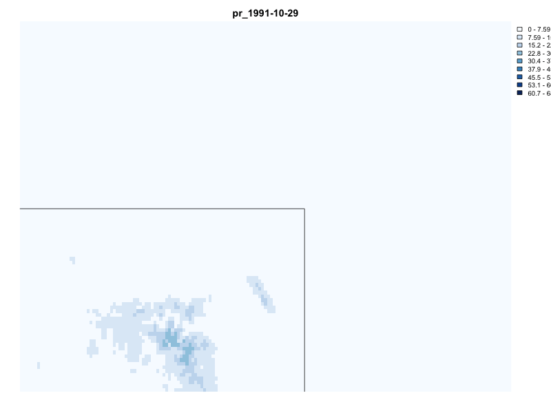
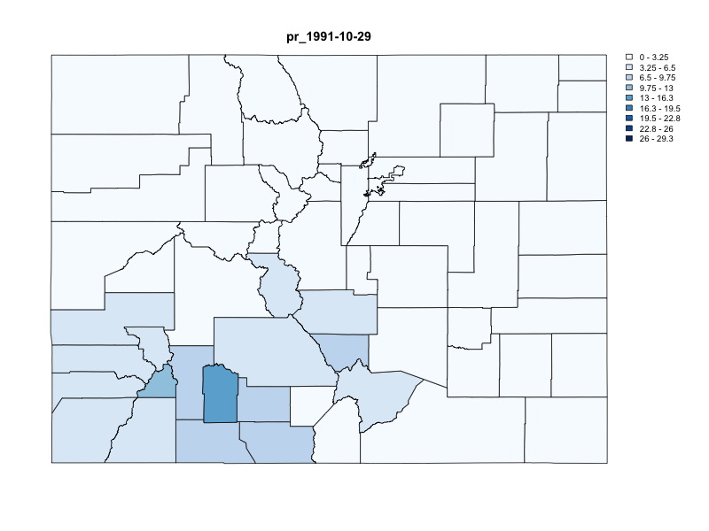

<!-- README.md is generated from README.Rmd. Please edit that file -->

```{r, include = FALSE}
knitr::opts_chunk$set(
  collapse = TRUE,
  comment = "#>",
  fig.path = "man/figures/README-",
  out.width = "100%",
  dev = "jpeg",
  warning = FALSE,
  message = FALSE
)

library(AOI)
devtools::load_all()
library(dplyr)
library(ggplot2)
library(tidyterra)
library(scales) # Additional library for labels
```

# Welcome!

<!-- badges: start -->
[](https://zenodo.org/badge/latestdoi/158620263)
[](https://github.com/mikejohnson51/climateR/actions/workflows/R-CMD-check.yaml)
[](#)
[](https://choosealicense.com/licenses/mit/)
[](https://www.repostatus.org/#active)
[](https://codecov.io/gh/mikejohnson51/climateR)
<!-- badges: end -->

`climateR` simplifies the steps needed to get gridded geospatial data into R. At its core, it provides three main things:

1. A catalog of `r nrow(climateR::catalog)` geospatial climate, land cover, and soils resources from `r length(unique(climateR::catalog$id))` collections. See (`climateR::catalog`)

This catalog is an [evolving, federated collection of datasets](https://github.com/mikejohnson51/climateR-catalogs) that can be accessed by the data access utilities. This resource is rebuilt automatically on a monthly cycle to ensure the data provided is accurate, while continuously growing based on user requests.

2. A general [toolkit for accessing remote and local gridded data](https://mikejohnson51.github.io/climateR/reference/index.html#data-access) files bounded by space, time, and variable constraints (`dap`, `dap_crop`, `read_dap_file`)

3. A set of [shortcuts](https://mikejohnson51.github.io/climateR/reference/index.html#shortcuts) that implement these methods for a core set of selected catalog elements

> :warning: **Python Users**: Data catalog access is available through the USGS [`gdptools`](https://gdptools.readthedocs.io/en/latest/) package. Directly analogous climateR functionality can be found in [`climatePy`](https://github.com/LynkerIntel/climatePy)

# Installation

```{r, eval = FALSE }
remotes::install_github("mikejohnson51/AOI") # suggested!
remotes::install_github("mikejohnson51/climateR")
```

# Basic Usage

The examples used here call upon the following shortcuts:

- `getGridMET` (OPeNDAP server, historic data)
- `getMODIS`   (Authenticated OPeNDAP server)
- `getMACA`    (OPeNDAP server, projection data)
- `getNLCD`    (COG)
- `get3DEP`    (VRT)
- `getCHIRPS`  (erddap)

With the aim of highlighting the convenience of a consistent access patterns for a variety of data stores.

### Defining Areas/Points of Interest

`climateR` is designed with the same concepts as `AOI`. Namely, that all spatial data aggregation questions must start with an extent/area of interest.

Before extracting any data, you must provide an. For the examples here, we will use the state of Colorado (polygons), and all of its cities (points).

```{r}
colorado = aoi_get(state = "CO", county = "all")

cities = readRDS(system.file("co/cities_colorado.rds", package = "climateR"))
```

```{r, echo = FALSE}
ggplot() + 
  geom_sf(data = colorado) + 
  geom_sf(data = cities, size = .5)  + 
  geom_sf(data = filter(cities, NAME == "FORT COLLINS"), color = "red", pch = 8, size = 2) + 
  theme_void() + 
  labs(title = "Colorado Counties and cities", 
       subtitle = "Fort Collins is in red")
```


## Extent extraction

The default behavior of `climateR` is to request data for the extent of the AOI passed regardless of whether it is `POINT` or `POLYGON` data. 

The _exception_ to the default behavior is if the the AOI is a single point. To illustrate:

#### POLYGON(s) act as a single extent

```{r}
# Request Data for Colorado (POLYGON(s))
system.time({
  gridmet_pr = getGridMET(AOI = colorado,
                 varname = "pr",
                 startDate = "1991-10-29",
                 endDate  = "1991-11-06")
})
```

```{r,echo = FALSE}
ggplot() +
  geom_spatraster(data = gridmet_pr$precipitation_amount) +
  facet_wrap(~lyr) +
  scale_fill_hypso_c(
    palette = "colombia_bathy",
    labels = label_number(suffix = "mm"),
    n.breaks = 12,
    guide = guide_legend(reverse = TRUE)
  ) +
  labs(
    fill = "",
    title = "Gridmet Rainfall for Colorado",
    subtitle = "1991-10-29 / 1991-11-03"
  ) + 
  theme_void()
```

#### POINTS(s) act as a single extent

```{r}
# Request data using cities (POINTs)

checkNetrc()
writeDodsrc()

modis_pet = getMODIS(
    AOI       = cities,
    asset    = 'MOD16A3GF.061',
    varname   = "PET_500m",
    startDate = "2020-10-29")
```


```{r, echo = FALSE}
ggplot() +
  geom_spatraster(data = modis_pet$PET_500m) +
  geom_spatvector(data = cities, color = "black", fill = NA, size = .01) +
  facet_wrap(~lyr) +
  scale_fill_hypso_c(
    palette = "dem_print",
    labels = label_number(suffix = "kg/m^2/yr"),
    n.breaks = 12,
    guide = guide_legend(reverse = TRUE)
  ) +
  labs(
    fill = "",
    title = "MODIS PET for Colorado",
    subtitle = "2020-10-29"
  ) +
  theme_void()
```

#### Single POINT(s) act as an extent 

However since the extent of a POINT means `{xmax = xmin}` and `{ymax = ymin}`, climateR will return a time series of the intersecting cell, opposed to a one cell `SpatRaster`.

```{r}
# Request data for a single city
system.time({
  future_city = getMACA(AOI = cities[1,],
                        varname = "tasmax",
                        startDate = "2050-10-29",
                        endDate  = "2050-11-06")
})
```

```{r}
future_city
```


#### Dynamic AOIs, tidyverse piping

All `climateR` functions treat the extent of the AOI and the default extraction area. This allows multiple climateR shortcuts to be chained together using either the base R or dplyr piping syntax.

```{r}
pipes = aoi_ext("Fort Collins", wh = c(10, 20), units = "km", bbox = TRUE)|>
  getNLCD() |>
  get3DEP() %>% 
  getTerraClimNormals(varname = c("tmax", "ppt"))

lapply(pipes, dim)
```

### Extract timeseries from exisitng objects:

Using `extract_sites`, you can pass an existing data object. If no identified column is provided to name the extracted timeseries, the first, fully unique column in the data.frame is used:

```{r}
gridmet_pts = extract_sites(gridmet_pr, pts = cities)
names(gridmet_pts)[1:5]

gridmet_pts = extract_sites(gridmet_pr, pts = cities, ID = 'NAME')
names(gridmet_pts)[1:5]
```

# Unit Based Extraction

While the default behavior is to extract data by **extent**, there are cases when the input AOI is a set of discrete units that you _want_ to act as discrete units.

- A set of `POINT`s from which to extract time series
- A set of `POLYGON`s that data should be summarized to (mean, max, min, etc.) (**WIP**)

In `climateR`, populating the `ID` parameter of any shortcut (or `dap`) function, triggers data to be extracted by unit. 

### Extact timeseries for POINTs

In the `cities` object, the individual `POINT`s are uniquely identified by a `NAME` column. Tellings a climateR function, that `ID = "NAME"` triggers it to return the summary:

```{r}
chirps_pts = getCHIRPS(AOI = cities,
                       varname = "precip",
                       startDate = "1991-10-29",
                       endDate  = "1991-11-06",
                       ID = "NAME")

dim(chirps_pts)
names(chirps_pts)[1:5]
```

```{r, echo = F}
ggplot() + 
  geom_point(data = gridmet_pts, aes(x = date, y = FORTCOLLINS, col = "gridmet")) + 
  geom_line(data = gridmet_pts, aes(x = date, y = FORTCOLLINS, col = "gridmet")) + 
  geom_point(data = chirps_pts, aes(x = date, y = FORTCOLLINS, col = "CHIRPS")) +
  geom_line(data = chirps_pts, aes(x = date, y = FORTCOLLINS, col = "CHIRPS")) + 
  theme_minimal() + 
  labs(title = "Comparative Rainfall in Fort Collins",
       subtitle = "1991-10-29 / 1991-11-03",
       color = "Model",
       y = "Rainfall (mm)",
       x = "Date")
```

### Integration with `zonal`

While climateR does not yet provide areal summaries, our intention is to integrate the functionality from `zonal`. Until then, `climateR` outputs can be piped directly into `execute_zonal`. The zonal package also requires a uniquely identifying column name, and a function to summarize data with.

```{r}
library(zonal)

system.time({
  chirps = getCHIRPS(AOI = colorado,
               varname = "precip",
               startDate = "1991-10-29",
               endDate  = "1991-11-06") %>% 
           execute_zonal(geom = colorado, 
                         fun = "max", 
                         ID = "fip_code")
})
```

```{r, echo = FALSE}
plot(chirps[grepl("precip_", names(chirps))])
```

## Basic Animation

### Gridded

```{r, eval = FALSE}
animation(gridmet_pr$precipitation_amount, AOI = AOI, outfile = "man/figures/rast_gif.gif")
```

```{r, echo = FALSE}

```

### Polygon

```{r, eval = FALSE}
animation(max, feild_pattern = "precip_", outfile = "man/figures/vect_gif.gif")
```

```{r, echo = FALSE}

```

