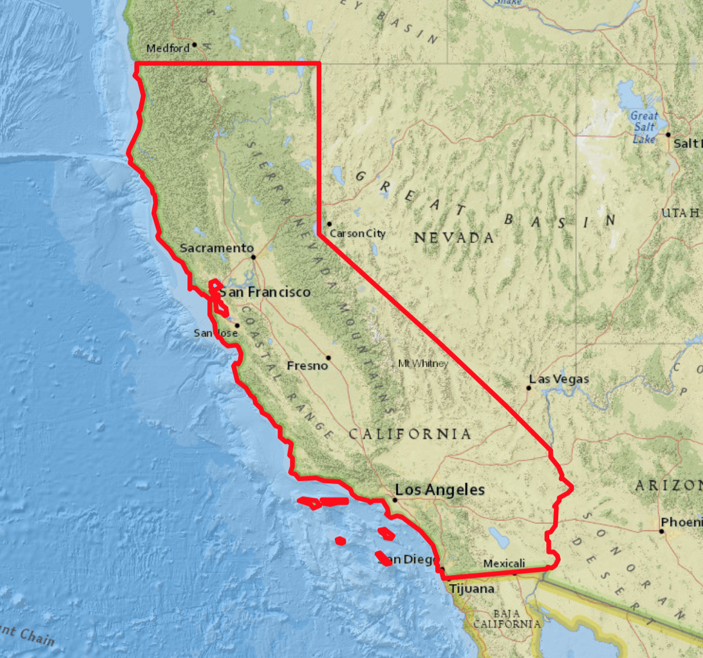
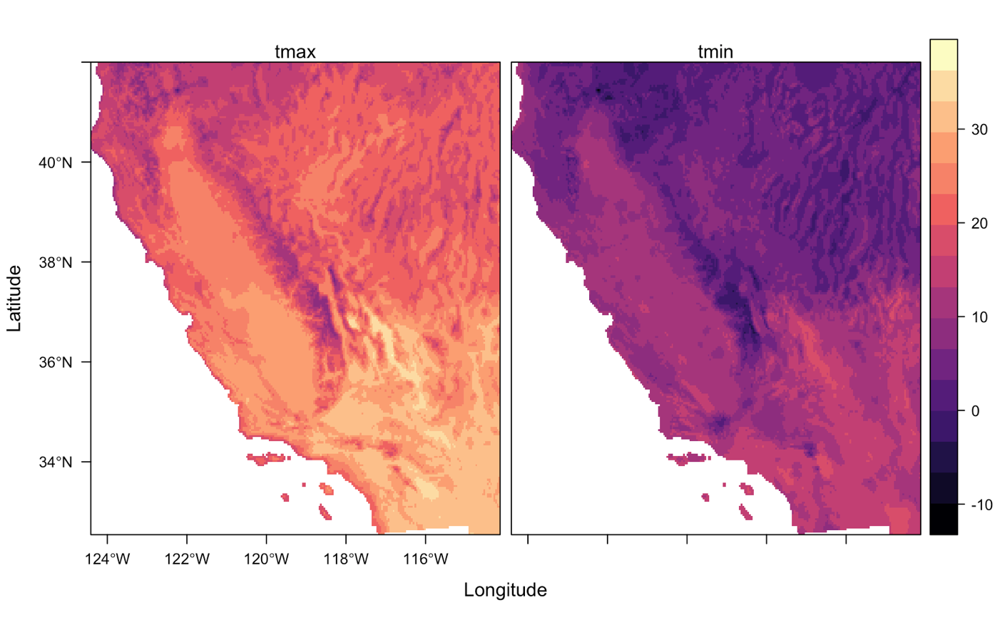
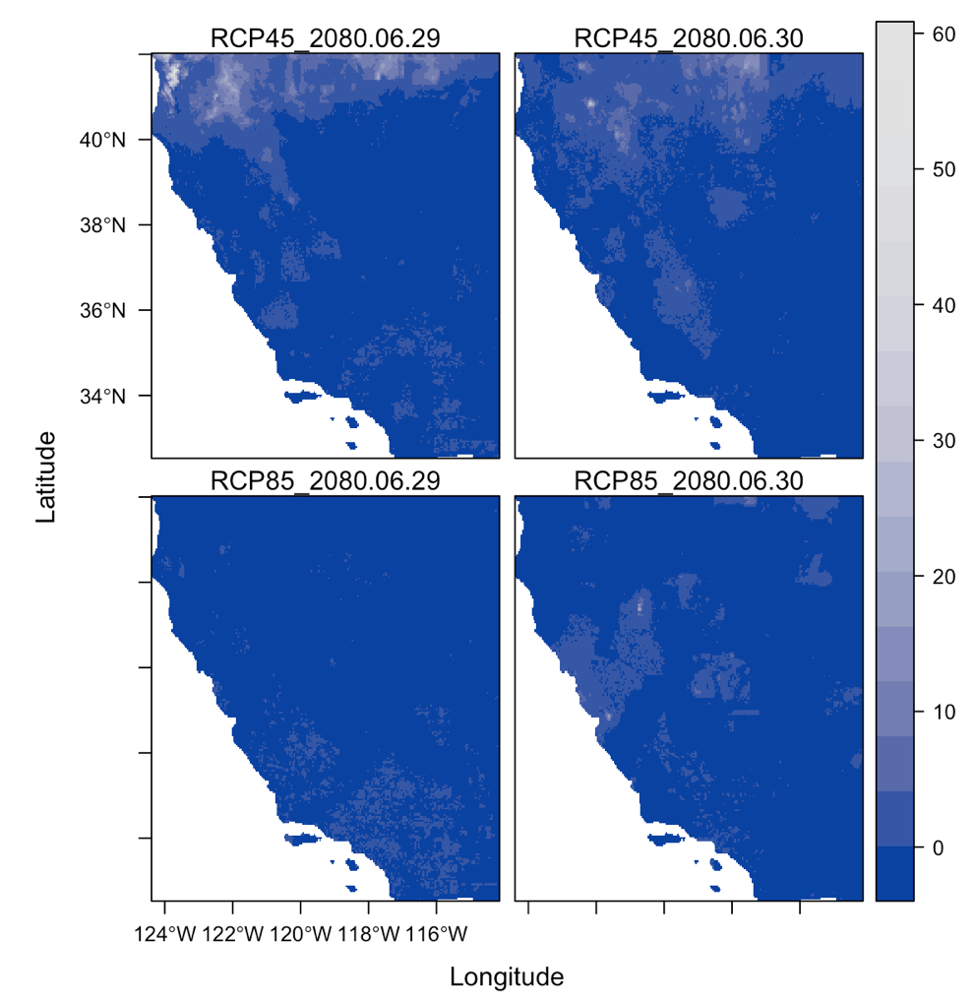
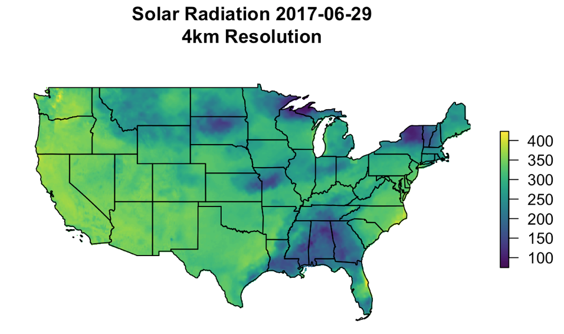
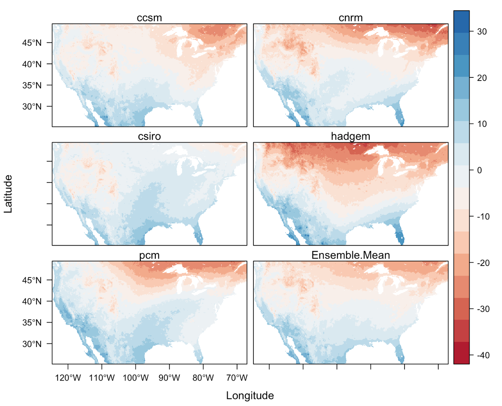
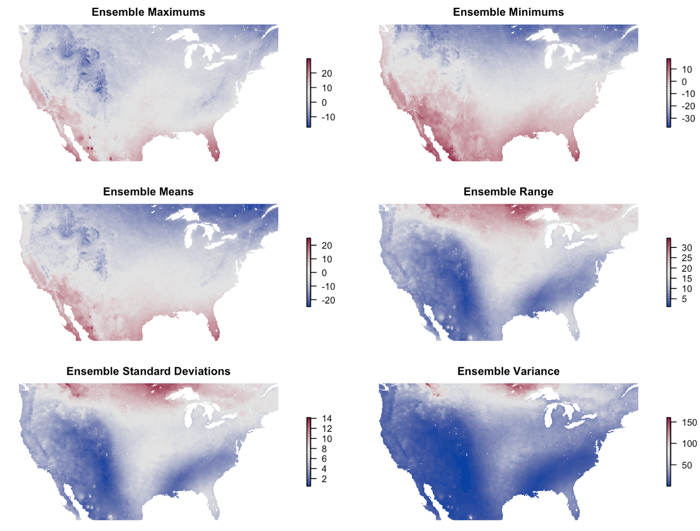
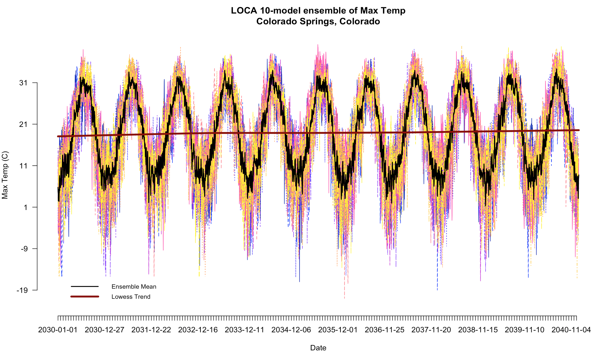

# climateR 
[](https://travis-ci.org/mikejohnson51/climateR)     [](https://zenodo.org/badge/latestdoi/158620263)


ClimateR looks to simplfy the steps needed to get raster climate data in R for Areas of Interest (AOI). It currently provides, or will provide, access to gridded climate sources as well as observation networks. Efforts have been made to reduce parameter variations (eg prcp and ppt) so that all calls require the same inputs. 


|**Number**|**Dataset**          | **Description**                                            | **Dates**         |
|----------|---------------------| -----------------------------------------------------------|-------------------|
|1         | **GridMET**         | Gridded Meteorological Data.                               | 1979-Yesterday    |
|2         | **Daymet**          | Daily Surface Weather and Climatological Summaries         | 1980-2017.        |
|3         | **TopoWX**          | Topoclimatic Daily Air Temperature Dataset                 | 1948-2016.        |
|4         | **PRISM**           | Parameter-elevation Regressions on Independent Slopes      | 1981-(Yesterday-1)|
|5         | **MACA**            | Multivariate Adaptive Constructed Analogs                  | 1950-2099         |
|6         | **LOCA**            | Localized Constructed Analogs                              | 1950-2100         |
|7         | **BCCA**            | Bias Corrected Constructed Analogs                         | 1950-2100         |
|8         | **NCEP**            | National Centers for Ecological Prediction.                | **In progress**   |
|9         | **SARRD**           | Statistical Asynchronous Regional Regression               | 1960-2100         |
|10        | **BCSD**            | Bias Corrected Spatially Downscaled VIC: Monthly Hydrology | 1950-2099         |
|11        | **OSSEB**           | Operational Simplified Surface Energy Balance              | 2000-2015         |
|12        | **TerraClimate**    | TerraClimate Monthly Gridded Data                          | 1958-2017 |
|13        | **CHIRPS**          | Climate Hazards Group InfraRed Precipitation with Station  | 1980-Current year |
|14        | **EDDI**            | Evaporative Demand Drought Index                           | 1980-Current year |

# Installation

```r
install.packages("devtools")
devtools::install_github("mikejohnson51/climateR")
```

# Examples

The climateR package works off the [AOI](https://github.com/mikejohnson51/AOI) framework established in the AOI R package. This framework is also used in [HydroData](https://github.com/mikejohnson51/HydroData), and [NWM](https://github.com/mikejohnson51/nwm). 

To get a climate product, an area of interest must be defined:

```r
AOI = getAOI(state = "CA")
```
<p align="center">

</p>

Here we are loading a spatial polygon for the state of California. More examples of contruting AOI calls can be found [here](https://mikejohnson51.github.io/AOI/).

With an AOI, we can construct a call to a dataset for a parameter(s) and date(s) of choice. Here we are querting the PRISM dataset for maximum and mimimun temperture estimates for October 29, 2018:

```r
system.time({
p = getPRISM(AOI, param = c('tmax','tmin'), startDate = "2018-10-29")
})

>  user  system elapsed 
  0.057   1.054   4.845 
```

```r
r = raster::stack(p$tmax, p$tmin)
names(r) = c('tmax', 'tmin')
rasterVis::levelplot(r)
```
<p align="center">

</p>

Some sources are  downscaled Global Climate Models (GCMs). These allow you to query future forecasted ensemble members. One example is from the MACA dataset:

```r
system.time({
m = getMACA(AOI, 
            model = "CCSM4", 
            param = 'prcp', 
            scenario = c('rcp45', 'rcp85'), 
            startDate = "2080-06-29", 
            endDate = "2080-06-30")
})

>  user  system elapsed 
  0.183   1.213   5.998
```

```r
r = raster::stack(m$prcp_rcp45, m$prcp_rcp85)
names(r) = paste0(c(rep("RCP45_", 2), rep("RCP85_", 2)), unique(substring(names(r), 2, 11)))
rasterVis::levelplot(r, par.settings = rasterTheme(region=sequential_hcl(10, power=2.2)))
```
<p align="center">

</p>

Large scale data grabs are also quite efficient

```r
system.time({
  g = getAOI(state = "conus") %>%  getGridMET(param = 'srad', startDate = "2017-06-29")
})

>   user  system elapsed 
  0.304   1.618   6.063 
```

```r
raster::plot(g$srad, col = viridis::viridis(100), axes = F, box= F)
title(main = "Solar Radiation 2017-06-29\n4km Resolution")
sp::plot(g$AOI, add = T)
```

<p align="center">

</p>

Getting ensemble averages is also quite simple:

```r

models = c('ccsm', 'cnrm', 'csiro', 'hadgem', 'pcm')

system.time({
  temp = getAOI(state = "conus") %>% getSARRD(param = 'tmin', model = models, ensemble = 'a2', startDate = "2080-11-29")
})

> user  system elapsed 
0.554   1.798  36.724
```

```r
#stack model outputs
s = stack(temp)

# add mean to stack
s = addLayer(s, mean(s))
names(s) = c(models, "Ensemble")

# Plot
levelplot(s, par.settings = RdBuTheme)
```
<p align="center">

</p>

Statistics are not limited to mean: 

```r 
stats= stack(max(s), min(s), mean(s), max(s) - min(s), calc(s, sd), sum((s - mean(s))^2) / 5)
names(stats) = c("Ensemble Max", "Ensemble Min", "Ensemble Mean",  "Ensemble Range",  "Ensemble SD",  "Ensemble Variance")
```
<p align="center">

</p>

Not all datasets are USA focused. The TerraClimate Dataset offers global, monthly data up to the current year. Here we can get the PDSI (Palmer Index for October 2017):

```r
w = AOI::world %>% getTerraClim(param = 'palmer', startDate = '2017-10-10')
```
<p align="center">

</p>

Finally, data gathering is not limitied to areas and can be done as a time series for a point. Here we look for a 10-model ensemble for maximum temperture in Colorado Springs, Colorado from the LOCA downscaled dataset between Jan 1, 2030 and Decemeber 31, 2040.

```r
system.time({
  ts = geocode('Colorado Springs') %>% 
       getLOCA(param = 'tmax', model = 10, startDate = "2030-01-01", endDate = "2040-12-31")
})
> user  system elapsed 
2.716   4.506  193.675 

```

In a little over 3 minutes we collected **40,180** data points (~208 per second). The results can be seen below:

<p align="center">

</p>

### Support:

ClimateR is written by [Mike Johnson](https://mikejohnson51.github.io), a graduate Student at the [University of California, Santa Barbara](https://geog.ucsb.edu) in [Keith C. Clarke's](http://www.geog.ucsb.edu/~kclarke/) Lab, 2018 and is funded through the NOAA National Water Center (NWC) via the UCAR COMET Program (2017/18).
