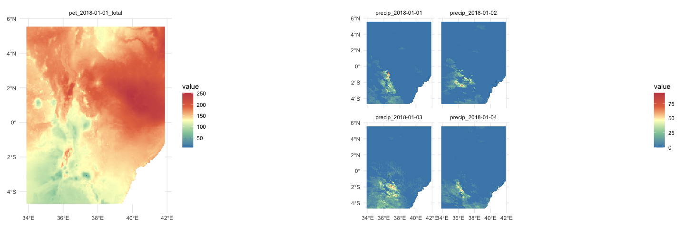
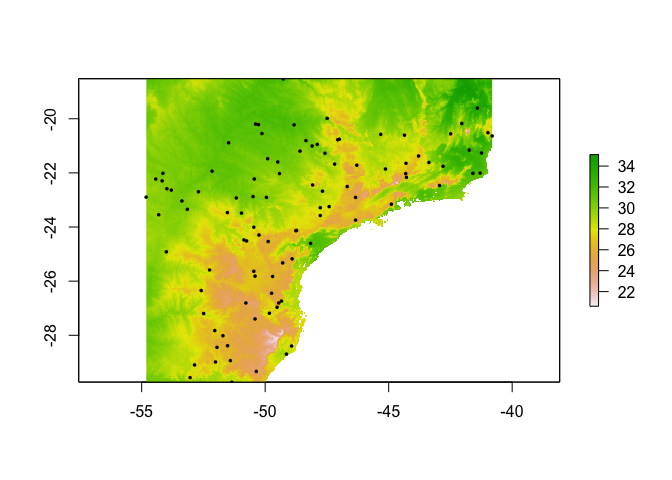
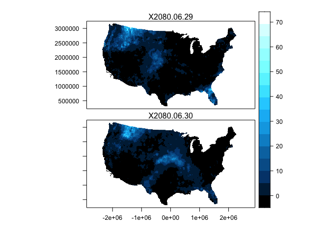

<!-- README.md is generated from README.Rmd. Please edit that file -->

# climateR 

<!-- badges: start -->

[](https://zenodo.org/badge/latestdoi/158620263)
[](https://github.com/mikejohnson51/climateR/actions/workflows/R-CMD-check.yaml)
[](#)
[](https://choosealicense.com/licenses/mit/)
[](https://www.repostatus.org/#active)
[](https://lifecycle.r-lib.org/articles/stages.html#experimental)
[](https://codecov.io/gh/mikejohnson51/climateR)
<!-- badges: end -->

`climateR` simplifies the steps needed to get climate data into R. At
its core it provides three main things:

1.  A climate catalog of over 100,000k datasets from over 2,000 data
    providers/archives. See (climateR::params)

``` r
nrow(params)
#> [1] 105307
length(unique(params$id))
#> [1] 2074
length(unique(params$asset))
#> [1] 4628
```

2.  A general toolkit for accessing remote and local gridded data files
    bounded by space, time, and variable constants

3.  A set of shortcuts that implement these methdods for a core set of
    selcted catalog elements

# Installation

``` r
remotes::install_github("mikejohnson51/AOI") # suggested!
remotes::install_github("mikejohnson51/climateR")
```

# Usful Packages for climate data

``` r
library(AOI)
library(climateR)
library(tidyterra)
library(ggplot2)
library(terra)
library(tidyr)
library(sf)
```

# Examples

The climateR package is supplemented by the
[AOI](https://github.com/mikejohnson51/AOI) framework established in the
AOI R package.

To get a climate product, an area of interest must be defined:

``` r
AOI = aoi_get(state = "NC")
plot(AOI$geometry)
```


Here we are loading a polygon for the state of North Carolina More
examples of constructing AOI calls can be found
[here](https://mikejohnson51.github.io/AOI/).

With an AOI, we can construct a call to a dataset for a parameter(s) and
date(s) of choice. Here we are querying the PRISM dataset for maximum
and minimum temperature on October 29, 2018:

``` r
system.time({
 p = getPRISM(AOI, varname = c('tmax','tmin'), startDate = "2018-10-29")
})
#>    user  system elapsed 
#>   0.368   0.037   1.424
```


# Data from known bounding coordinates

`climateR` offers support for `sf`, `sfc`, and `bbox` objects. Here we
are requesting wind velocity data for the four corners region of the USA
by bounding coordinates.

``` r
AOI = st_as_sfc(st_bbox(c(xmin = -112, xmax = -105, ymax = 39, ymin = 34), crs = 4326))

g = getGridMET(AOI, 
               varname = "vs",
               startDate = "2018-09-01")

ggplot() +
  geom_spatraster(data = rast(g)) +
  facet_wrap(~lyr) +
  scale_fill_whitebox_c(
    palette = "muted",
    na.value = "white"
  ) + 
  geom_sf(data = AOI::aoi_get(state  = c("CO", "NM", "AZ", "UT")), fill = NA) + 
  theme_minimal()
```


# Data through time …

In addition to multiple variables we can request variables through time,
here let’s look at the gridMET rainfall for the Gulf Coast during
Hurricane Harvey:

``` r
harvey = getGridMET(aoi_get(state = c("TX", "FL")), 
                  varname = "pr", 
                  startDate = "2017-08-20", endDate = "2017-08-31")

ggplot() +
  geom_spatraster(data = harvey$precipitation_amount) +
  facet_wrap(~lyr) +
  scale_fill_whitebox_c(
    palette = "muted",
    na.value = "white") + 
  theme_minimal()
```


# Climate Projections

Some sources are downscaled Global Climate Models (GCMs). These allow
you to query forecasted ensemble members from different models and/or
climate scenarios. One example is from the MACA dataset:

``` r
system.time({
m = getMACA(AOI = aoi_get(state = "FL"), 
            model = "CCSM4", 
            varname = 'pr', 
            scenario = c('rcp45', 'rcp85'), 
            startDate = "2080-06-29", endDate = "2080-06-30")
})
#>    user  system elapsed 
#>   0.191   0.025   1.616
```

``` r
ggplot() +
  geom_spatraster(data = rast(m)) +
  facet_wrap(~lyr) +
  scale_fill_whitebox_c(
    palette = "muted",
    na.value = "white"
  ) + theme_minimal()
```


Getting multiple models results is also quite simple:

``` r
models = c("BNU-ESM","CanESM2", "CCSM4")

temp =  getMACA(AOI = aoi_get(state = "CO"),
                varname = 'tasmin', 
                model = models, 
                startDate = "2080-11-29")

temp$air_temperature$mean =  terra::app(temp$air_temperature, mean)
names(temp[[1]]) = c(models, "Ensemble Mean")

# Plot
ggplot() +
  geom_spatraster(data = temp$air_temperature) +
  facet_wrap(~lyr) +
  scale_fill_whitebox_c(
    palette = "muted",
    na.value = "white"
  ) + theme_minimal()
```

 If
you don’t know your models, you can always grab a random set by
specifying a number:

``` r
random = getMACA(aoi_get(state = "MI"), 
                 model = 3, 
                 varname = "pr", 
                 startDate = "2050-10-29")

# Plot
ggplot() +
  geom_spatraster(data = random$precipitation) +
  facet_wrap(~lyr) +
  scale_fill_whitebox_c(
    palette = "muted",
    na.value = "white"
  ) + 
  theme_minimal()
```


# Global Datasets

Not all datasets are USA focused either. TerraClimate offers global,
monthly data up to the current year for many variables, and CHIRPS
provides daily rainfall data:

``` r

kenya = aoi_get(country = "Kenya")
tc = getTerraClim(kenya, varname = "pet", startDate = "2018-01-01")
chirps = getCHIRPS(kenya, startDate = "2018-01-01", endDate = "2018-01-04" )

library(patchwork)

ggplot() +
  geom_spatraster(data = tc$pet_total) +
  facet_wrap(~lyr) +
  scale_fill_whitebox_c(
    palette = "muted",
    na.value = "white"
  ) + 
  theme_minimal() + 
  ggplot() +
  geom_spatraster(data = chirps$precip) +
  facet_wrap(~lyr) +
  scale_fill_whitebox_c(
    palette = "muted",
    na.value = "white"
  ) + 
  theme_minimal()
```



# Point Based Data

Finally, data gathering is not limited to areal extents and can be
retrieved as a time series at locations.

``` r
AOI = 

ts  = getGridMET(geocode('Fort Collins', pt = TRUE), 
                 varname =  c("pr", 'srad'), 
                 startDate = "2021-01-01", 
                 endDate = "2021-12-31")
```

``` r
ggplot(data = ts, aes(x = date, y = srad)) + 
  geom_line() +
  stat_smooth(col = "red") + 
  theme_linedraw() + 
  labs(title = "Solar Radiation: Fort Collins 2019",
       x = "Date", y = "Solar Radiation") +
ggplot(data = ts, aes(x = date, y = cumsum(pr))) + 
  geom_line(color = "blue", lwd = 1) +
  theme_linedraw() + 
  labs(title = "Cumulative Rainfall: Fort Collins 2019",
       x = "Date", y = "Rainfall")
```


# Point Based Ensemble

``` r
future = getMACA(geocode("Fort Collins", pt = TRUE), 
                 model = 5, varname = "tasmax", 
                 startDate = "2050-01-01", endDate = "2050-01-31")

future_long = pivot_longer(future, -date) 


ggplot(data = future_long, aes(x = date, y = value, col = name)) + 
  geom_line() + 
  theme_linedraw() + 
  scale_color_brewer(palette = "Dark2") + 
  labs(title = "Fort Collins Temperture: January, 2050",
       x = "Date",
       y = "Degree K",
       color = "Model")
```



# Multi site extraction

Extracting data for a set of points is an interesting challenge. It
turns it is much more efficient to grab the underlying raster stack and
then extract time series as opposed to iterating over the locations:

1.  Starting with a set of locations in Colorado:

``` r
(f = system.file("co/co_cities.rds", package = "climateR"))
#> [1] "/Users/mjohnson/Library/R/x86_64/4.2/library/climateR/co/co_cities.rds"
cities = readRDS(f)
```

2.  `climateR` will grab the RasterStack underlying the bounding area of
    the points

``` r
sites_stack = getTerraClim(AOI   = cities, 
                           varname = "tmax", 
                           startDate = "2018-01-01", 
                           endDate   = "2018-12-31")
```

``` r
{
  plot(sites_stack$tmax_total[[1]])
  plot(vect(cities), add = TRUE, pch = 16, cex = .5)
}
```


3.  Use `extract_sites` to extract the times series from these
    locations. The `id` parameter is the unique identifier from the site
    data with which to names the resulting columns.

``` r
sites_wide = extract_sites(r = sites_stack, pts = cities, id = "NAME")
sites_wide[[1]][1:5, 1:5]
#>                  date ADAMSCITY AGATE AGUILAR AKRON
#> 1 2018-01-01 00:00:00       9.5   8.2    11.4   7.1
#> 2 2018-01-31 10:00:00       8.1   7.1     9.9   5.8
#> 3 2018-03-02 20:00:00      14.6  14.1    15.0  13.5
#> 4 2018-04-02 06:00:00      17.5  16.6    17.6  16.2
#> 5 2018-05-02 16:00:00      25.1  25.0    25.5  24.8
```

To make the data ‘tidy’ simply pivot on the `date` column:

    #> # A tibble: 6 × 3
    #>   date                name       value
    #>   <dttm>              <chr>      <dbl>
    #> 1 2018-01-01 00:00:00 ADAMSCITY    9.5
    #> 2 2018-01-01 00:00:00 AGATE        8.2
    #> 3 2018-01-01 00:00:00 AGUILAR     11.4
    #> 4 2018-01-01 00:00:00 AKRON        7.1
    #> 5 2018-01-01 00:00:00 ALAMOSA      5.2
    #> 6 2018-01-01 00:00:00 ALLENSPARK   6.1


