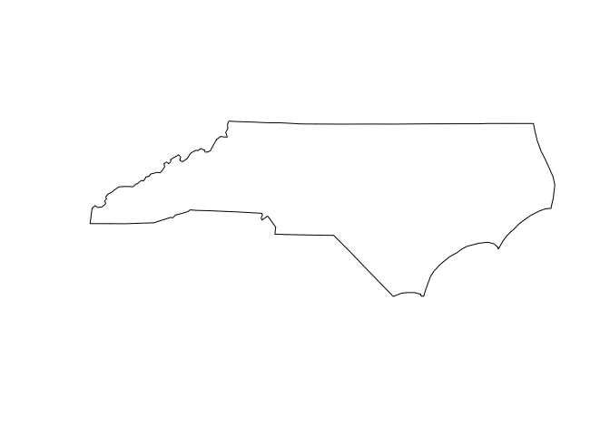
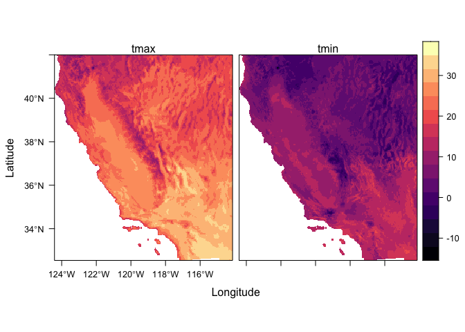

<!-- README.md is generated from README.Rmd. Please edit that file -->

# climateR

<!-- badges: start -->

[](https://zenodo.org/badge/latestdoi/158620263)
[](https://github.com/mikejohnson51/climateR/actions/workflows/R-CMD-check.yaml)
[](#)
[](https://choosealicense.com/licenses/mit/)
[](https://www.repostatus.org/#active)
[](https://codecov.io/gh/mikejohnson51/climateR)
<!-- badges: end -->

`climateR` simplifies the steps needed to get climate data into R. At
its core it provides three main things:

1.  A climate catalog of over 100,000k datasets from over 2,000 data
    providers/archives. See (climateR::params)

``` r
nrow(params)
#> [1] 107857
length(unique(params$id))
#> [1] 2075
length(unique(params$asset))
#> [1] 4653
```

2.  A general toolkit for accessing remote and local gridded data files
    bounded by space, time, and variable constraints (`dap`, `dap_crop`,
    `read_dap_file`)

3.  A set of shortcuts that implement these methods for a core set of
    selected catalog elements

# Installation

``` r
remotes::install_github("mikejohnson51/AOI") # suggested!
remotes::install_github("mikejohnson51/climateR")
```

# Basic Usage

## Rainfall from GridMet for Colorado

### October 29,1991 - November 6, 1991

``` r
library(AOI)
library(terra)
library(climateR)

AOI = aoi_get(state = "CO", county = "all")
plot(AOI$geometry)
```



``` r
d = getGridMET(AOI,
               varname = "pr",
               startDate = "1991-10-29",
               endDate  = "1991-11-06")

plot(d$precipitation_amount)
```


