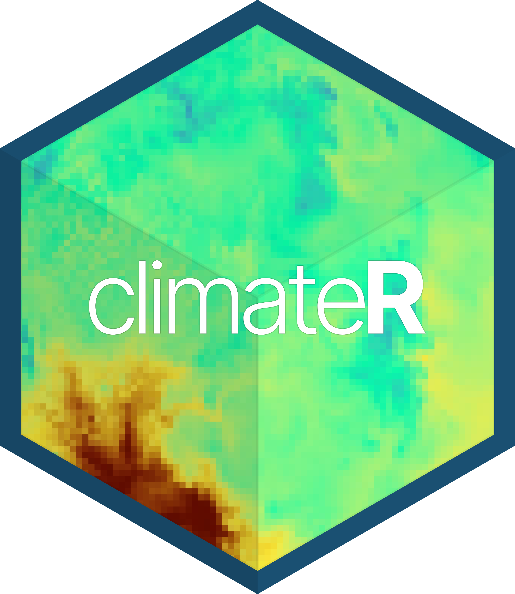

<!-- README.md is generated from README.Rmd. Please edit that file -->

# climateR 

[](https://travis-ci.org/mikejohnson51/climateR)
[](https://zenodo.org/badge/latestdoi/158620263)

`climateR` seeks to simplifiy the steps needed to get climate data into
R. It currently provides access to the following gridded climate sources
using a single parmaeter

| **Number** | **Dataset**      | **Description**                                            | **Dates**            |
| ---------- | ---------------- | ---------------------------------------------------------- | -------------------- |
| 1          | **GridMET**      | Gridded Meteorological Data.                               | 1979 - Yesterday     |
| 2          | **Daymet**       | Daily Surface Weather and Climatological Summaries         | 1980 - 2019          |
| 3          | **TopoWX**       | Topoclimatic Daily Air Temperature Dataset                 | 1948 - 2016          |
| 4          | **PRISM**        | Parameter-elevation Regressions on Independent Slopes      | 1981 - (Yesterday-1) |
| 5          | **MACA**         | Multivariate Adaptive Constructed Analogs                  | 1950 - 2099          |
| 6          | **LOCA**         | Localized Constructed Analogs                              | 1950 - 2100          |
| 7          | **BCCA**         | Bias Corrected Constructed Analogs                         | 1950 - 2100          |
| 8          | **BCSD**         | Bias Corrected Spatially Downscaled VIC: Monthly Hydrology | 1950 - 2099          |
| 9          | **TerraClimate** | TerraClimate Monthly Gridded Data                          | 1958 - 2019          |
| 10         | **CHIRPS**       | Climate Hazards Group InfraRed Precipitation with Station  | 1980 - Current month |
| 11         | **EDDI**         | Evaporative Demand Drought Index                           | 1980 - Current year  |

# Installation

``` r
remotes::install_github("mikejohnson51/AOI") # suggested!
remotes::install_github("mikejohnson51/climateR")
```

# Usful Packages for climate data

``` r
library(AOI)
library(climateR)
library(sf)
library(raster)
library(rasterVis)
```

# Examples

The climateR package is supplimented by the
[AOI](https://github.com/mikejohnson51/AOI) framework established in the
AOI R package.

To get a climate product, an area of interest must be defined:

``` r
AOI = aoi_get(state = "NC")
plot(AOI$geometry)
```


Here we are loading a polygon for the state of California. More examples
of constructing AOI calls can be found
[here](https://mikejohnson51.github.io/AOI/).

With an AOI, we can construct a call to a dataset for a parameter(s) and
date(s) of choice. Here we are querying the PRSIM dataset for maximum
and minimum temperature on October 29, 2018:

``` r
system.time({
 p = getPRISM(AOI, param = c('tmax','tmin'), startDate = "2018-10-29")
})
#>    user  system elapsed 
#>   0.644   0.161   1.768
```

``` r
r = raster::stack(p)
names(r) = names(p)
rasterVis::levelplot(r, par.settings = BuRdTheme) +
  layer(sp.lines(as_Spatial(AOI), col="gray30", lwd=3))
```


# Data from known bounding coordinates

`climateR` offers support for `sf`, `sfc`, and `bbox` objects. Here we
are requesting wind velocity data for the dour corners region of the USA
by bounding coordinates.

``` r
AOI = st_bbox(c(xmin = -112, xmax = -105, ymax = 39, ymin = 34), crs = 4326) %>% 
  getGridMET(param = "wind_vel", startDate = "2018-09-01")

rasterVis::levelplot(AOI$wind_vel, margin = FALSE, main = "Four corners Wind Velocity")
```


# Data through time …

In addition to multiple variables we can request variables through time,
here lets look at the gridMET rainfall for the Gulf Coast during
Hurricane Harvey:

``` r
harvey = getGridMET(aoi_get(state = c("TX", "FL")), 
                  param = "prcp", 
                  startDate = "2017-08-20", endDate = "2017-08-31")

levelplot(harvey$prcp, par.settings = BTCTheme, main = "Hurricane Harvey")
```


# Climate Projections

Some sources are downscaled Global Climate Models (GCMs). These allow
you to query foretasted ensemble members from different models and/or
climate scenarios. One example is from the MACA dataset:

``` r
system.time({
m = getMACA(aoi_get(state = "FL"), 
            model = "CCSM4", 
            param = 'prcp', 
            scenario = c('rcp45', 'rcp85'), 
            startDate = "2080-06-29", endDate = "2080-06-30")
})
#>    user  system elapsed 
#>   0.354   0.121   4.081
```

``` r
r = raster::stack(m)
names(r) = paste(rep(names(m), each = 2), names(m[[1]]))
levelplot(r, par.settings = BTCTheme)
```


Getting multiple models results is also quite simple:

``` r
models = c("bnu-esm","canesm2", "ccsm4", "cnrm-cm5", "csiro-mk3-6-0")

temp =  getMACA(AOI = aoi_get(state = "conus"),
                  param = 'tmin', 
                  model = models, 
                  startDate = "2080-11-29")

s = stack(temp)
s = addLayer(s, mean(s))
names(s) = c(models, "Ensemble Mean")

# Plot
rasterVis::levelplot(s, par.settings = rasterVis::BuRdTheme)
```

 If
your dont know your models, you can always grab a random set by
specifying a number:

``` r
random = getMACA(aoi_get(state = "MI"), model = 3, param = "prcp", startDate = "2050-10-29")
random = stack(random) %>% setNames(names(random))
levelplot(stack(random), par.settings = BTCTheme)
```


# Global Datasets

Not all datasets are USA focused either. TerraClimate offers global,
monthly data up to the current year for many variables, and CHIRPS
provides daily rainfall data:

``` r

kenya = aoi_get(country = "Kenya")
tc = getTerraClim(kenya, param = "prcp", startDate = "2018-01-01")
chirps = getCHIRPS(kenya, startDate = "2018-01-01", endDate = "2018-01-04" )

p1 = levelplot(tc$prcp, par.settings = BTCTheme, main = "January 2018; TerraClim", margin = FALSE) +
  layer(sp.lines(as_Spatial(kenya), col="white", lwd=3))
p2 = levelplot(chirps,  par.settings = BTCTheme, main = "Janaury 1-4, 2018; CHIRPS", layout=c(2, 2)) +
  layer(sp.lines(as_Spatial(kenya), col="white", lwd=3))

gridExtra::grid.arrange(p1,p2, nrow = 1)
```


This raises the question “*what is available for each resource?*”. This
can be checked in the appropriate meta\_data objects. For example lets
see what parameter data is offered for gridMET, and what models and
scenarios are offered for MACA.

``` r
head(param_meta$gridmet)
#>   common.name call                               description
#> 1        prcp   pr                      precipitation_amount
#> 2       rhmax rmax           daily_maximum_relative_humidity
#> 3       rhmin rmin           daily_minimum_relative_humidity
#> 4        shum  sph              daily_mean_specific_humidity
#> 5        srad srad daily_mean_shortwave_radiation_at_surface
#> 6    wind_dir   th                 daily_mean_wind_direction
#>                          units
#> 1                           mm
#> 2                      Percent
#> 3                      Percent
#> 4                        kg/kg
#> 5                        W/m^2
#> 6 Degrees Clockwise from north

head(model_meta$maca)
#>           model ensemble scenario
#> 1       BNU-ESM   r1i1p1    rcp45
#> 2      CNRM-CM5   r1i1p1    rcp45
#> 3 CSIRO-Mk3-6-0   r1i1p1    rcp45
#> 4    bcc-csm1-1   r1i1p1    rcp45
#> 5       CanESM2   r1i1p1    rcp45
#> 6    GFDL-ESM2G   r1i1p1    rcp45
```

# Point Based Data

Finally, data gathering is not limited to areal extents and can be
retrieved as a time series at locations.

``` r
AOI = AOI::geocode('Colorado Springs', pt = TRUE)
ts  = getGridMET(AOI, param = 'srad', startDate = "2019-01-01", endDate = "2019-12-31")

ggplot(data = ts) + 
  aes(x = date, y = srad) + 
  geom_line() +
  stat_smooth(col = "red") + 
  theme_linedraw() + 
  labs(title = "Solar Radiation: Colorado Springs 2019", x = "Date", y = "Solar Radiation")
```


# Point Based Ensemble

``` r
future = getMACA(geocode("UCSB", pt = TRUE), 
                 model = 5, param = "tmax", 
                 startDate = "2050-01-01", endDate = "2050-01-31")

future_long = future %>% 
  dplyr::select(-source, -lat, -lon) %>% 
  tidyr::pivot_longer(-date) 

ggplot(data = future_long, aes(x = date, y = value, col = name)) + 
  geom_line() + 
  theme_linedraw() + 
  scale_color_brewer(palette = "Dark2") + 
  labs(title = "UCSB Temperture: January, 2050",
       x = "Date",
       y = "Degree K",
       color = "Model")
```


# Multi site extraction

Extracting data for a set of points is an interesting challenge. It
turns it is much more efficient to grab the underlying raster stack and
then extract timeseries as opposed to iterating over the locations:

1.  Starting with a set of locations in Brazil:

<!-- end list -->

``` r
(sites = read.csv('./inst/extdata/example.csv') %>% 
  st_as_sf(coords = c("long", "lat"), crs = 4326))
#> Simple feature collection with 100 features and 2 fields
#> geometry type:  POINT
#> dimension:      XY
#> bbox:           xmin: -54.81975 ymin: -29.73627 xmax: -40.80975 ymax: -18.52627
#> geographic CRS: WGS 84
#> First 10 features:
#>         X     ID                    geometry
#> 1  190760 190760 POINT (-50.40975 -25.81627)
#> 2  267801 267801 POINT (-48.15975 -24.60627)
#> 3  219885 219885 POINT (-49.28975 -25.32627)
#> 4  200445 200445 POINT (-50.45975 -25.63627)
#> 5   74789  74789 POINT (-51.70975 -28.01627)
#> 6   18343  18343 POINT (-50.35975 -29.33627)
#> 7  143615 143615 POINT (-49.33975 -26.73627)
#> 8  588292 588292 POINT (-47.57975 -21.27627)
#> 9  371314 371314 POINT (-47.76975 -23.28627)
#> 10 638894 638894 POINT (-46.99975 -20.75627)
```

2.  `climateR` will grab the RasterStack underlying the bounding area of
    the points

<!-- end list -->

``` r
sites_stack = getTerraClim(AOI = sites, 
                           param ="tmax", 
                           startDate = "2018-01-01", endDate = "2018-12-31")


plot(sites_stack$tmax$X2018.01)
plot(sites$geometry, add = TRUE, pch = 16, cex = .5)
```


3.  Use `extract_sites` to extract the times series from these
    locations. The `id` parameter is the unique identifier from the site
    data with which to names the resulting columns.

<!-- end list -->

``` r
sites_wide = extract_sites(sites_stack, sites, "ID")
sites_wide$tmax[1:5, 1:5]
#>         date site_190760 site_267801 site_219885 site_200445
#> 1 2018-01-01        26.9        31.5        25.6        26.2
#> 2 2018-02-01        26.6        30.1        25.2        25.8
#> 3 2018-03-01        26.4        30.8        25.6        26.0
#> 4 2018-04-01        25.3        28.3        24.8        24.9
#> 5 2018-05-01        21.5        25.1        21.7        21.2
```

To make the data ‘tidy’ simply pivot on the date column:

``` r
tmax = tidyr::pivot_longer(sites_wide$tmax, -date)
head(tmax)
#> # A tibble: 6 x 3
#>   date       name        value
#>   <date>     <chr>       <dbl>
#> 1 2018-01-01 site_190760  26.9
#> 2 2018-01-01 site_267801  31.5
#> 3 2018-01-01 site_219885  25.6
#> 4 2018-01-01 site_200445  26.2
#> 5 2018-01-01 site_74789   26.7
#> 6 2018-01-01 site_18343   24

ggplot(data = tmax, aes(x = date, y = value, col = name)) + 
  scale_color_viridis_d() +
  geom_line() + 
  theme_linedraw() + 
  theme(legend.position = "none") 
```


### Support:

ClimateR is written by [Mike Johnson](https://mikejohnson51.github.io),
a graduate Student at the [University of California, Santa
Barbara](https://geog.ucsb.edu) in [Keith C.
Clarke’s](http://www.geog.ucsb.edu/~kclarke/) Lab.
