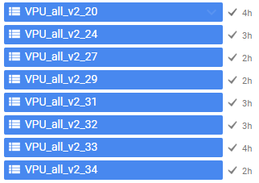

```{r, include = FALSE}
options(width=100)
knitr::opts_chunk$set(
  collapse = TRUE,
  comment = "#>",
  out.width = "100%",
  warning = FALSE,
  message = TRUE
)
```
# Examples

We all can agree that access to tools to perform spatial operations has revolutionized the field of hydrologic sciences by offering a powerful platforms to access satellite imagery, reanalysis products, and diverse datasets crucial for spatial analysis and hydrologic modeling. These tools facilitate the retrieval and processing of vast amounts of geospatial data, allowing researchers and practitioners to perform comprehensive analyses at various spatial and temporal scales, which in turn greatly benefits the field of hydrology.

Our team at Lynker have developed [climateR](https://github.com/mikejohnson51/climateR.git) and [climatePy](https://github.com/LynkerIntel/climatePy).The key advantages of using platforms like climateR is the accessibility to a wealth of satellite imagery spanning multiple decades. With archives of satellite data readily available, hydrologists can track changes in land cover, monitor hydrologic phenomena, and assess the impacts of climate change on water resources. The ability to access and analyze historical data allows for the identification of long-term trends, facilitating better understanding and prediction of hydrologic processes. 

Furthermore, climateR foster collaboration and knowledge sharing within the hydrologic community. It provide a platform for scientists and researchers across the globe to access standardized datasets, share methodologies, and collaborate on solving complex hydrologic challenges. Also, puts forth an easy and accessible way to perform large spatiotemporal operations that support any NOAA effort. This collaborative environment encourages the development of innovative models and techniques for water resource management and decision-making.

Here we demonstrate several examples of how to access these databases using climateR and perform massive spatial and temporal aggregations.  

## Massive Spatial Aggregation of TerraClimate 

The integration of reanalysis products and various datasets in this platform enables users to perform sophisticated spatial operations and analyses. Hydrologists can aggregate data over specific points or polygons, allowing for the extraction of critical information regarding water resources, such as precipitation patterns, evapotranspiration rates, and soil moisture content. This facilitates the characterization of watersheds, the assessment of water availability, and the prediction of potential flood or drought events.

Here I want to extract long term, 20 year historical mean value of TerraClimate variables for all NOAA Next Generation (NextGen) National Hydrologic Geospatial Fabric (hydrofabric) divides. As you no doubt surmised, this is a very expensive task but with climateR it will become a more straight forward task.

One can access the NextGen hydrofabric from the Lynker-spatial s3 account: 

```{r, eval = FALSE}
# Then specify the S3 bucket and file path
bucket_name <- "lynker-spatial"
file_key    <- "v20/gpkg/nextgen_12.gpkg"

# Now download the GeoPackage file from S3 to a temporary file
temp_file <- tempfile(fileext = ".gpkg")

s3read_using(file   = temp_file, 
             FUN    = get_object, 
             object = file_key, 
             bucket = bucket_name)

# Finally read the GeoPackage file into an sf object
gpkg_sf <- st_read(temp_file)
```

Now we can extract the divides layer for the given VPU and extract data from TerraClimate:

```{r, eval = FALSE}
# List of VPU's for CONUS
vpu_list = vpu_boundaries$VPUID[1:21]

# Variables of Interest
vars <- c("PDSI","aet","soil","def","ppt","q","tmin","tmax","pet")

# Loop through the VPU's and extract data and time the execution 
system.time({
    for (vpu in vpu_list) {
        # Read the file
        file_key <- paste0("v20/gpkg/nextgen_", vpu, ".gpkg")
        
        # Download the GeoPackage file from S3 to a temporary file
        temp_file <- tempfile(fileext = ".gpkg")
        s3read_using(file = temp_file, 
                     FUN = get_object, 
                     object = file_key, 
                     bucket = bucket_name)

        # Just read the divides
        divides = read_sf(temp_file, "divides")

        # Use climateR to extract the variables between 2000-2021
        out_raster <- getTerraClim(AOI       = divides,
                                   varname   =  vars,
                                   startDate = "2000-01-01",
                                   endDate   = "2021-01-01")

        # Use rast() to do a temporal mean aggregation and zonal to do a spatial aggregation using divide_id
        output = execute_zonal(data = rast(lapply(out_raster, mean)), 
                               geom = div, 
                               fun = "mean", 
                               ID = "divide_id", 
                               join = FALSE)

        # Finally write the data frame to a parquet file
        write_parquet(output, sprintf("/your_path/conus_terraclimate_vpu_%s.parquet", vpu))
    }
})
```

We just calculated 20 year average of 9 different variables over 882,945 divides that cover CONUS under an hour (2472.777 seconds = .68 hours) on my normal laptop!! This is very impressive. 

## Comparison to GEE

Now lets compare this to the well known and frequently used Google Earth Engine (GEE). 

To start, we cannot process all 882,945 divides at the same time in GEE and my personal experience has shown that batches of 200 divides is the ideal size to avoid the infamous `Computation Timed Out Error`. 

So we can write a script to perform batch operation such as below.

```{javascript}
// This requires uploading the divides into EE assets
// A for loop to execute 100 batches of 200 divides as an example
for (var i=1; i<100; i++){
    runExtract(divides, i, 'last');
}

runExtract(divides, 100, 'first');

function runExtract(data, num, first){
    var list_feature = data.toList(data.size());
    var batch = num;
    
    switch(first){
        case 'first':
        var data = ee.FeatureCollection(list_feature.slice(0, 2000-(batch-1)*200));
        break;
        case 'last':
        var data = ee.FeatureCollection(list_feature.slice(2000-batch*200, 2000-(batch-1)*200));
        break;
        case 'custom':
        var data = ee.FeatureCollection(list_feature);
        break;
    }
    batch = batch.toString();


    // Load TerraClimate
    var dataset = ee.ImageCollection('IDAHO_EPSCOR/TERRACLIMATE')
                    .filter(ee.Filter.date('2000-01-01', '2022-01-01'));
    // Performs a temporal mean 
    var aet = dataset.mean().select('aet');   
    var soil = dataset.mean().select('soil');   
    var pet = dataset.mean().select('pet');   
    var def = dataset.mean().select('def');   
    var pdsi = dataset.mean().select('pdsi');   
    var ro = dataset.mean().select('ro');  
    var tmmn = dataset.mean().select('tmmn'); 
    var tmmx = dataset.mean().select('tmmx'); 

    // _______Extract data_________________
    function updateDivides(img_dataset, old_dataset, bandname, newname, reducer)
    {
        function dataExtract(feat)
        {
            
        var stats = img_dataset.reduceRegion({
            reducer: reducer,
            geometry: feat.geometry(),
            scale: 4638.3,  
            bestEffort: true
        });
        
        return ee.Algorithms.If(ee.Number(stats.size()).eq(0), 
                                    feat.set(newname, ee.Number(999999999)),
                                    feat.set(newname, stats.first().get(bandname)));
        
        }
        var new_dataset = old_dataset.map(dataExtract);
        return new_dataset;
    }

    data = updateStation(aet, data,'aet', 'aet', ee.Reducer.mean());
    data = updateStation(soil, data,'soil', 'soil', ee.Reducer.mean());
    data = updateStation(pet, data,'pet', 'pet', ee.Reducer.mean());
    data = updateStation(def, data,'def', 'def', ee.Reducer.mean());
    data = updateStation(pdsi, data,'pdsi', 'pdsi', ee.Reducer.mean());
    data = updateStation(ro, data,'ro', 'ro', ee.Reducer.mean());
    data = updateStation(tmmn, data,'tmmn', 'tmmn', ee.Reducer.mean());
    data = updateStation(tmmx, data,'tmmx', 'tmmx', ee.Reducer.mean());

    var exp_name = 'TerraClimate_divide_b'+batch;
  
    Export.table.toDrive(data, exp_name, 'TerraClimate_exports', exp_name, 'CSV');
}
```

**Breaking this into batches 200 each set of two batchs takes about 1-3 hours to complete (see figure below). Based on this, for the scale of our application, GEE would require weeks to finish!! **


```{r, echo = FALSE}

```

## Massive Temporal and Spatial Aggregation with GLDAS 

Now lets say we have even more computationally demanding task as we try to find a historical mean over a daily product from GLDAS. In this case we can break our period into chunks (e.g., 4 years) and extract data.

```{r, eval = FALSE}
# Define start and end dates
start_date <- ymd("2004-01-01")
end_date <- ymd("2021-01-01")

# Create a sequence of dates with a step of 4 years
date_seq <- seq(start_date, end_date, by = "4 years")

# New names for the columns
vars <- c("qsb_tavg", "qs_tavg", "gws_tavg", "esoil_tavg", "ecanop_tavg", "canopint_tavg", "avgsurft_tavg")

# Loop through the VPU's and extract data and time the execution 
system.time({
    for (vpu in vpu_list) {
        # Read the file
        file_key <- paste0("v20/gpkg/nextgen_", vpu, ".gpkg")
        
        # Download the GeoPackage file from S3 to a temporary file
        temp_file <- tempfile(fileext = ".gpkg")
        
        s3read_using(file = temp_file, 
                     FUN = get_object,
                     object = file_key, 
                     bucket = bucket_name)

        # Just read the divides
        divides = read_sf(temp_file, "divides")

        for (i in seq_along(date_seq)) {
            current_start <- date_seq[i]
            current_end <- current_start + years(4) - days(1)

            current_start <- format(current_start, "%Y-%m-%d")
            current_end <- format(current_end, "%Y-%m-%d")
            print(paste("initiated batch > ", current_start))

            # Use climateR to extract the variables between 2004-21
            out_raster <- getGLDAS(AOI = div,
                                   varname = vars,
                                   model = "CLSM025_DA1_D.2.2", 
                                   startDate = current_start,
                                   endDate.  = current_end)

            output = execute_zonal(data = rast(lapply(out_raster, mean)), geom = div, fun = "mean", ID = "divide_id", join = FALSE)
            current_start_year <- as.character(year(current_start))
            current_end_year <- as.character(year(current_end))
            write_parquet(output, sprintf("/your_path/conus_gldas_vpu_%s_date_%s_%s.parquet", vpu, current_start_year, current_end_year))
        }
    }
})
```

## Custom Data

We can also use custom datasets form our local drive or s3 bucket to perform different aggregations. Here as an example we can access POLARIS soil dataset and do just a spatial average of multiple virtual rasters over all our divide polygons.

This collection of POLARIS data has been resampled from its native 30m resolution to a 300m COG.

```{r, eval = FALSE}
vars = c("alpha", "om", "ph")
data = rast(glue('/vsis3/lynker-spatial/gridded-resources/polaris300/{vars}_mean_0_5.tif'))

system.time({
    for (vpu in vpu_list) {
        # Read the file
        file_key <- paste0("v20/gpkg/nextgen_", vpu, ".gpkg")
        
        # Download the GeoPackage file from S3 to a temporary file
        temp_file <- tempfile(fileext = ".gpkg")
        
        s3read_using(file = temp_file, 
                     FUN = get_object, object = file_key, 
                     bucket = bucket_name)

        # Just read the divides
        divides = read_sf(temp_file, "divides")

        polaris = execute_zonal(data = data, 
                                geom = divides, fun = "mean", 
                                ID = "divide_id", 
                                join = FALSE)
        
        # Finally write the data frame to a parquet file
        write_parquet(output, sprintf("/your_path/conus_polaris_vpu_%s.parquet", vpu))
    }
})
```


# Conclusion

In summary, using climateR significantly benefits hydrological sciences by providing unprecedented access to diverse datasets. These tools empower researchers, policymakers, and water resource managers to conduct in-depth spatial analyses, ultimately enhancing our understanding of hydrological processes and improving water resource management strategies for a more sustainable future.