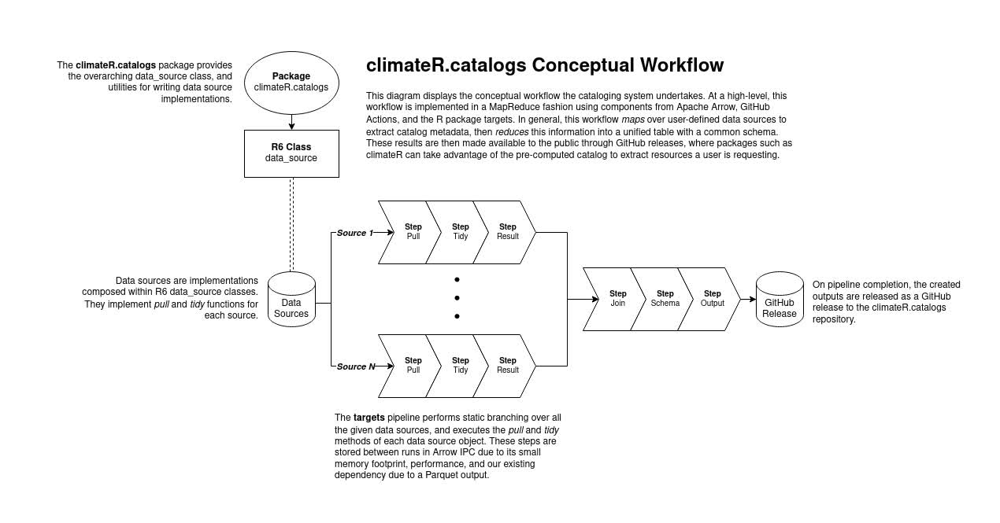

# Catalogs

In order to provide an evolving, federated collection of datasets, `climateR` makes use of a
a preprocessed catalog, updated on a monthly cycle. This catalog is hosted and generated from
the [climateR-catalogs repository](https://github.com/mikejohnson51/climateR-catalogs).

This catalog contains over 100,000 thousand datasets from over 2,000 data providers/archives.
The following section describes the design of the catalog and its data pipeline.

## Design

```{r, echo = FALSE}

```

The catalog data pipeline uses the [targets](https://docs.ropensci.org/targets/) package to establish
a declarative workflow using *data sources* as target creators. In particular, data sources are 
treated as *dynamic plugins* to the data pipeline, such that data sources are composable within the pipeline
through a framework utilizing [R6](https://r6.r-lib.org/index.html) classes.

The data source R6 classes expose a simple interface to plugin creators, where adding a new data source
is defined by giving a data source three things:

1. an `id`
2. a `pull` function
3. a `tidy` function

The `id` represents a unique identifier for the data source that is contained with the final catalog.
The `pull` function is a function containing any number of arguments that should gather catalog items
from an endpoint, and collect them into a `data.frame`. The `tidy` function is a function that accepts
*at least* a single argument for the output of the `pull` function. The function should perform any
necessary actions to conform the argument as close to the catalog schema as possible.

Using the data sources built on top of this R6-based framework, the pipeline is then given targets that
correspond to (1) loading the R6 class, (2) calling the `pull` function, and (3) calling the `tidy` function.
These three steps are mapped across all available data sources that are loaded into the pipeline environment,
and joined together to create a seamless table representing the catalog. Finally, the schema of the table is
handled to ensure it conforms to the catalog specification, and outputs for JSON and Parquet are released.

### Technical Details


#### Targets Serialization

A key point to highlight is that with the targets R package, individual targets are serialized to a specific
format when completed. Dependent targets also read from this serialization format back into R as necessary.
The default format for targets is to use the R RDS format. However, since this pipeline already requires an
[Apache Arrow](https://arrow.apache.org/) dependency due to a Parquet output, we take advantage of the
[Arrow IPC file/stream formats](https://arrow.apache.org/docs/python/ipc.html) for serialization of these targets.
Specifically, the `pull` and `tidy` targets always return the data source R6 class, and the succeeding targets for
the catalog generation return a data frame. For the targets returning R6 classes, a custom serializer that performs
I/O between the R6 class and its metadata to Arrow IPC Stream format is implemented. For the targets returning data frames,
we use the Arrow IPC File format.

The Arrow IPC formats were chosen in this fashion due to the smaller memory footprint and the performance
gained from zero-copy pass between targets. This also enables data sources to be built in various programming
languages and access the same data if needed, again due to the zero-copy property of Arrow's IPC formats.

#### Pipeline Infrastructure

With the catalog data pipeline built on top of R and the targets package, to aid in generating the catalog,
we utilize [GitHub Actions](https://github.com/features/actions). Despite it being primarily for
[CI/CD](https://en.wikipedia.org/wiki/CI/CD) workflows, the concept of CI/CD can be generalized to data as well.
For example, in data engineering, [Apache Airflow](https://airflow.apache.org/) is a predominant application for
constructing data workflows. Between the two, the primary difference is that GitHub Actions is further generalized,
and offers less direct integrations for data engineering.

With that context in mind, the GitHub Actions workflow for the catalog data pipeline is, in essence, a runner that
calls `targets::tar_make()` to run the pipeline. When all of the targets are complete, the workflow takes the outputted
catalog files and uploads them to the GitHub repository as a release. Furthermore, this workflow is scheduled to run on
a monthly basis, ensuring that the catalog stays consistently up to date with the latest datasets offered by the data providers
that are described in the data source plugins.

#### Release Strategy

With each monthly Github Actions update, a new release of the catalog will be provided in JSON and parquet formats at the [release page](https://github.com/mikejohnson51/climateR-catalogs/releases/latest/download/).

