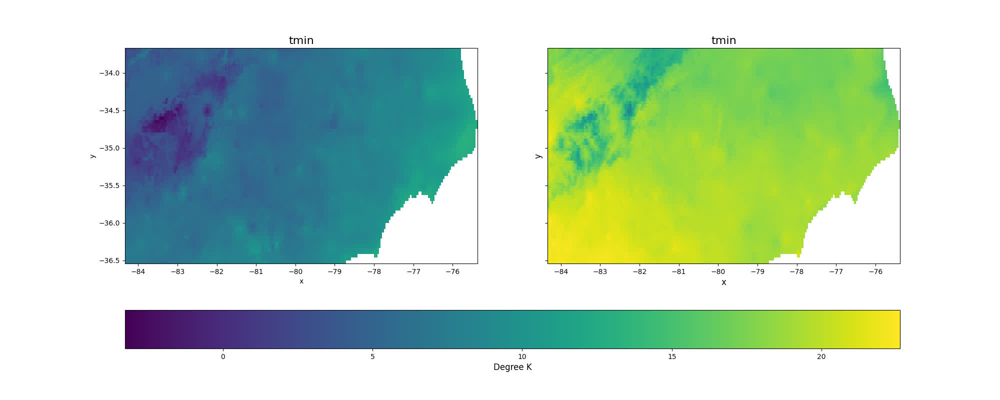
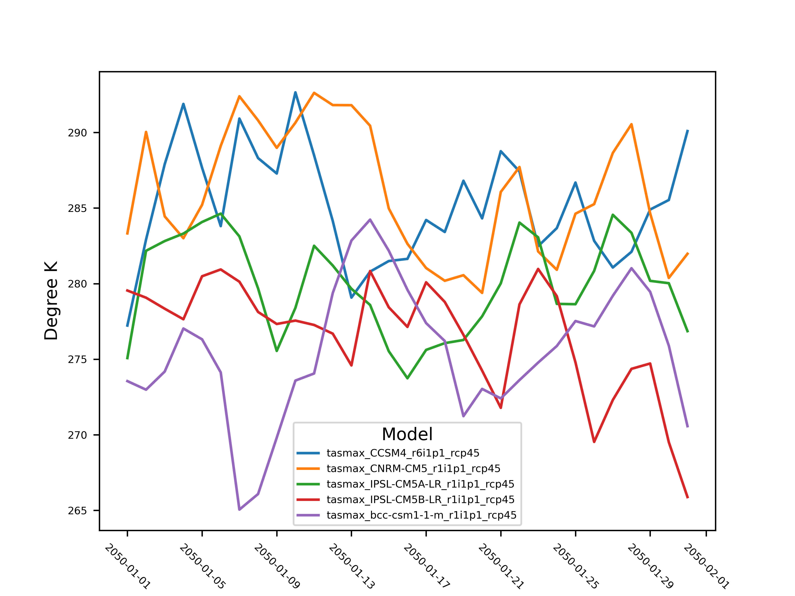
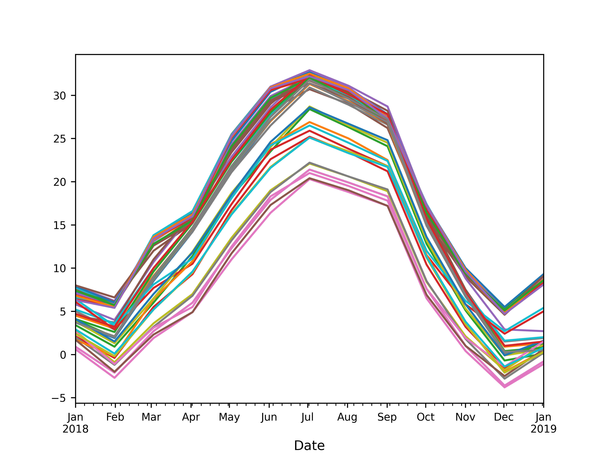

```{r, include = FALSE}
knitr::opts_chunk$set(
  collapse = TRUE,
  comment = "#>",
  out.width = "100%",
  warning = FALSE,
  message = FALSE
)
library(knitr)
library(rmarkdown)
library(reticulate)
library(sf)
library(AOI)
library(ggplot2)

# kenya <- AOI::aoi_get(country = "Kenya")
# northcar <- AOI::aoi_get(state = "North Carolina")
# harvey <- AOI::aoi_get(state = c("Texas", "Florida"))
# michigan <- AOI::aoi_get(state = c("Michigan"))
# co <- AOI::aoi_get(state = "Colorado")
# fl <- AOI::aoi_get(state = "Florida")
# # sf::st_bbox(kenya)
# # sf::st_bbox(northcar)
# # sf::st_bbox(harvey)
# # sf::st_bbox(michigan)
# sf::st_bbox(co)
# sf::st_bbox(fl)
# {
#   "north_carolina": [-84.32182, 33.75288, -75.40012,  36.58814 ],
#   "kenya": [33.89357, -4.67677, 41.85508,  5.50600 ],
#   "harvey": [-106.64548,   24.39631,  -79.97431,   36.50070 ],
#   "michigan": [-90.41839,  41.69612, -82.12297,  48.30606 ],
#   "colorado": [-109.06019,  36.99246, -102.04152,  41.00342 ],
#   "florida": [-87.63479,  24.39631, -79.97431,  31.00097 ]
# }
```

# Useful Packages for climate data

```{python, eval = F, echo = T}
# climatePy
import climatePy

# vector data libs
import geopandas as gpd
import shapely
from shapely.geometry import box

# gridded data libs
import xarray as xr

# geoencoding service 
import geopy

# misc
import numpy as np
import pandas as pd
import random
import joblib

# plotting libs
import matplotlib.pyplot as plt
import seaborn as sns
```

# climatePy examples

The `climatePy` package is supplemented by the [geopy](https://github.com/geopy/geopy) Python package which allows for an easy to use interface for many geocoding APIs.

To get a climate product, an area of interest must be defined:

```{r,eval = T, echo = F}
# Sys.sleep(5)
```

```{python, eval = T, echo = F}

aoi_map = {"north_carolina": [-84.32182, 33.75288, -75.40012,  36.58814 ],
  "kenya": [33.89357, -4.67677, 41.85508,  5.50600 ],
  "harvey": [-106.64548,   24.39631,  -79.97431,   36.50070 ],
  "michigan": [-90.41839,  41.69612, -82.12297,  48.30606 ],
  "colorado": [-109.06019,  36.99246, -102.04152,  41.00342 ],
  "florida": [-87.63479,  24.39631, -79.97431,  31.00097 ]
  }
  
def make_aoi(bb_map, k):
  
  xmin = bb_map[k][0]
  ymin = bb_map[k][1]
  xmax = bb_map[k][2]
  ymax = bb_map[k][3]

  # make bounding box
  # AOI = box(xmin, ymin, xmax, ymax)

  aoi = gpd.GeoDataFrame({
    "geometry" : [box(xmin, ymin, xmax, ymax)]
    }, 
    crs = "EPSG:4326"
    )
    
  return aoi
```

```{python, eval = F, echo = F}
AOI = make_aoi(aoi_map, "north_carolina")
```

```{python, eval = F, echo = T}
# get AOI polygon from OpenStreetMap API
nom = geopy.geocoders.Nominatim(user_agent="climatePy")
geolocal = nom.geocode("North Carolina", geometry='wkt')

AOI = gpd.GeoDataFrame(
  {"geometry" : [shapely.wkt.loads(geolocal.raw['geotext'])]
  }, 
  crs = "EPSG:4326"
  )
```

```{python, eval = F, echo = F}
# plot aoi
ax = AOI.plot(facecolor = "none", edgecolor = "black")
ax.set_axis_off()
plt.savefig("/man/figures/nc_shape.jpg")
plt.show()
```

```{r echo=FALSE, out.width="100%", fig.align='center'}
# knitr::include_graphics("img/raster_data_model.jpg")
knitr::include_graphics("../man/figures/nc_shape.jpg")
```

```{r, eval = F, echo = FALSE}
AOI = AOI::aoi_get(state = "NC")
plot(AOI$geometry)
```

Here we are loading a polygon for the state of North Carolina More examples of constructing AOI calls can be found [here](https://geopy.readthedocs.io/en/stable/#module-geopy.geocoders)

With an AOI, we can construct a call to a dataset for a parameter(s) and date(s) of choice. Here we are querying the PRISM dataset for maximum and minimum temperature on October 29, 2018:

```{python, eval = F, echo = T}
p = climatePy.getPRISM(
   AOI       = AOI, 
   varname   = ['tmax','tmin'], 
   startDate = "2018-10-29",
   timeRes   = "daily",
   dopar     = False
   )
```

```{python, eval = F, echo = F}
out = [p["tmin"], p["tmax"]]

# Get the maximum and minimum values for both datasets
vmin = min(p["tmin"].min(), p["tmax"].min())
vmax = max(p["tmin"].max(), p["tmax"].max())

# fig, (ax1, ax2) = plt.subplots(ncols=2, sharey=True, figsize=(20, 6))
fig, axes = plt.subplots(ncols=2,sharey=True, figsize=(20, 8))

for i in range(len(axes.flat)):
  ax = axes.flat[i]
  im = out[i].plot(ax=ax,vmin=vmin, vmax=vmax,  add_colorbar = False)
  ax.set_title(out[0].name,  fontsize=16)
  
# set sharing color bar
cb = fig.colorbar(im, ax=axes.ravel().tolist(), orientation="horizontal")

# add legend label for variables
cb.set_label("Degree K",  fontsize=12)

plt.ylabel('y', fontsize=12)
plt.xlabel('x', fontsize=12)

# plt.tight_layout()
plt.savefig("/man/figures/nc_prism_data.jpg")
plt.show()
#################
# # Get the maximum and minimum values for both datasets
# vmin = min(p["tmin"].min(), p["tmax"].min())
# vmax = max(p["tmin"].max(), p["tmax"].max())
# p["tmin"].plot(ax=ax1,vmin=-10, vmax=23,  add_colorbar = False)
# # p["tmin"].plot(ax=ax1,vmin=vmin, vmax=vmax,  add_colorbar = False)
# ax1.set_title("tmin")
# p["tmax"].plot(ax=ax2, vmin=-10, vmax=23, yticks=[])
# # p["tmax"].plot(ax=ax2, vmin=vmin, vmax=vmax,add_colorbar = False)
# ax2.set_title("tmax")
# plt.gca().set_ylabel('')
# ax2.legend()
# # plt.tick_params(axis='x', labelsize=8)
# # plt.tick_params(axis='y', labelsize=8)
# # fig.savefig("north_carolina_tmin_tmax.jpg")
# plt.tight_layout()
# plt.show()
```

```{python, eval = F, echo = F}
plt.close()
```

```{r echo=FALSE, out.width="100%", fig.align='center'}
# knitr::include_graphics("img/raster_data_model.jpg")

```

# Data from known bounding coordinates

`climatePy` offers support for `shapely` and `geopandas` objects. Here we are requesting wind velocity data for the four corners region of the USA by bounding coordinates.


```{python, eval = F, echo = T}
from shapely.geometry import box

# 4 corners region of USA
xmin, xmax, ymin, ymax = -112, -105, 34, 39

# make bounding box
AOI = box(xmin, ymin, xmax, ymax)

# insert bounding box into geodataframe
# AOI = gpd.GeoDataFrame(geometry=[AOI], crs ='EPSG:4326')

g = climatePy.getGridMET(
       AOI       = AOI, 
       varname   = "vs",
       startDate = "2018-09-01",
       dopar     = False
       )
```


```{python, eval = F, echo = F}
plt.figure(figsize=(20, 14))
g["vs"].isel(time = 0).plot(vmin=0, vmax=5,  add_colorbar = True)
plt.gca().set_xlabel('')
plt.gca().set_ylabel('')
plt.title(str(g["vs"].isel(time = 0).time.values)[0:13])
# plt.tick_params(axis='x', labelsize=8)
# plt.tick_params(axis='y', labelsize=8)
# fig.savefig("north_carolina_tmin_tmax.jpg")
plt.savefig("/man/figures/nc_tmin_tmax_gridmet.jpg")
plt.show()
```

```{python, eval = F, echo = F}
plt.close()
```

```{r echo=FALSE, out.width="100%", fig.align='center'}
# knitr::include_graphics("img/raster_data_model.jpg")
knitr::include_graphics("../man/figures/nc_tmin_tmax_gridmet.jpg")
```

# Data through time ...

In addition to multiple variables we can request variables through time, here let's look at the gridMET rainfall for the Gulf Coast during Hurricane Harvey:

```{r,eval = F, echo = F}
# Sys.sleep(5)
```

```{python, eval = F, echo = F}
AOI = make_aoi(aoi_map, "harvey")
```

```{python, eval = F, echo =F}
texas   = nom.geocode("Texas", geometry='wkt')
```

```{r,eval = F, echo = F}
# Sys.sleep(5)
```

```{python, eval = F, echo =F}
florida = nom.geocode("Florida", geometry='wkt')
```

```{r,eval = F, echo = F}
# Sys.sleep(5)
```

```{python, eval = F, echo =F}
AOI     = gpd.GeoDataFrame({"geometry" : [shapely.wkt.loads(texas.raw['geotext']), shapely.wkt.loads(florida.raw['geotext'])]}, crs = "EPSG:4326")
```

```{python, eval = F, echo =T}
texas   = nom.geocode("Texas", geometry='wkt')
florida = nom.geocode("Florida", geometry='wkt')
AOI     = gpd.GeoDataFrame({
  "geometry" : [shapely.wkt.loads(texas.raw['geotext']), shapely.wkt.loads(florida.raw['geotext'])]
  }, 
  crs = "EPSG:4326"
  )
```


```{python, eval = F, echo =T}
harvey = climatePy.getGridMET(
  AOI       = AOI,
  varname   = "pr",
  startDate = "2017-08-20",
  endDate   = "2017-08-31",
  dopar     = False
  )
```


```{python, eval = F, echo =F}
# fig.set_size_inches(24, 14)
hplot = harvey['pr'].isel(time=slice(0, 12)).plot(
  x="x", 
  y="y", 
  col="time",
  col_wrap=4,   
  robust=True,
  cmap=plt.cm.RdYlBu_r,
  cbar_kwargs={
    "orientation": "horizontal",
    "shrink": 0.8,
    "aspect": 40,
    "pad": 0.1,
    },
    )
hplot.set_titles("")
plt.savefig("/man/figures/harvey_pr_gridmet.jpg")
# plt.savefig(f'img/ca_heatwave.jpg')
plt.show()
# fig.set_size_inches(24, 14)
# plt.tick_params(left = False, right = False , labelleft = False ,
#                 labelbottom = False, bottom = False)
# hplot = harvey['pr'].isel(time=slice(0, 12)).plot(x="x", y="y", col="time", col_wrap=4)
# hplot.set_titles("")
# # plt.savefig(f'img/ca_heatwave.jpg')
```

```{python, eval = F, echo = F}
plt.close()
```

```{r echo=FALSE, out.width="100%", fig.align='center'}
# knitr::include_graphics("img/raster_data_model.jpg")
knitr::include_graphics("../man/figures/harvey_pr_gridmet.jpg")
```

# Climate Projections 

Some sources are downscaled Global Climate Models (GCMs). These allow you to query forecasted ensemble members from different models and/or climate scenarios. One example is from the MACA dataset:

```{python, eval = F, echo = F}
AOI = make_aoi(aoi_map, "florida")
```

```{python, eval = F, echo = T, warning = FALSE, message = FALSE}
AOI = gpd.GeoDataFrame({
  "geometry" : [shapely.wkt.loads(florida.raw['geotext'])]}, 
  crs = "EPSG:4326"
  )
```

```{python, eval = F, echo =T, warning = FALSE, message = FALSE}
m = climatePy.getMACA(
  AOI       = AOI,
  model     = "CCSM4",
  varname   = "pr",
  scenario  = ["rcp45", "rcp85"],
  startDate = "2080-06-29",
  endDate   = "2080-06-30",
  dopar     = False
  )
```


```{python, eval = F, echo =F}

# m['pr']['time'] = np.char.replace(m['pr'].time.values.astype(str), '-00-00-00', '')

# scenarios = np.char.replace(m['pr'].time.values.astype(str), '-00-00-00', '')
# 
# # Apply the regular expression pattern to each string in the array
# matches = np.array([re.search(r'_([^_]+)$', s) for s in scenarios])
# np.array([m.group(1) if m else '' for m in matches]).astype(str)
# # Create a new dimension based on the modified time array
# new_dim = xr.DataArray(np.array([m.group(1) if m else '' for m in matches]).astype(str), dims='scenario')
# m['pr'] = m['pr'].expand_dims(scenario=new_dim)

# fix time strings
m['pr']['time'] = np.char.replace(m['pr'].time.values.astype(str), '-00-00-00', '')

fig.set_size_inches(20, 14)
maca_plot = m['pr'].isel(time=slice(0, 12)).plot(
  x="x",
  y="y",
  col="time",
  # row = "scenario",
  col_wrap=2,
  robust=False,
  # cmap=mpl.cm.RdYlBu_r,
  cbar_kwargs={
    # "orientation": "horizontal",
    "shrink": 0.8,
    "aspect": 40,
    "pad": 0.1
    # "label": "Precipitation",
    },
    )
# maca_plot.set_titles("")
# plt.savefig(f'img/ca_heatwave.jpg')
plt.savefig("/man/figures/florida_multi_model_maca.jpg")
plt.show()
```

```{python, eval = F, echo = F}
plt.close()
```

```{r echo=FALSE, out.width="100%", fig.align='center'}
# knitr::include_graphics("img/raster_data_model.jpg")
knitr::include_graphics("../man/figures/florida_multi_model_maca.jpg")
```

Getting multiple models results is also quite simple:

```{r,eval = F, echo = F}
# Sys.sleep(5)
```

```{python, eval = F, echo = F}
AOI = make_aoi(aoi_map, "colorado")
models = ["BNU-ESM","CanESM2", "CCSM4"]
```

```{python, eval = F, echo =F}
AOI     = gpd.GeoDataFrame({"geometry" : 
                [shapely.wkt.loads(nom.geocode("Colorado", geometry='wkt').raw['geotext'])]},
                crs = "EPSG:4326"
                )
models = ["BNU-ESM","CanESM2", "CCSM4"]
```

```{python, eval = F, echo =T}
AOI     = gpd.GeoDataFrame({"geometry" : 
                [shapely.wkt.loads(nom.geocode("Colorado", geometry='wkt').raw['geotext'])]},
                crs = "EPSG:4326"
                )
models = ["BNU-ESM","CanESM2", "CCSM4"]
```

```{python, eval = F, echo =T}
temp = climatePy.getMACA(
  AOI       = AOI,
  varname   = "tasmin",
  model = models,
  startDate = "2080-11-29",
  dopar     = False
  )
  
# calculate average Data Array
avg = temp['tasmin'].mean(dim = "time")
avg = avg.expand_dims(time = xr.DataArray(["tasmin_Ensemble_mean"], dims='time')).transpose('x', 'y', 'time')

# Concatonate original data arrays with average data array
temp['tasmin'] = xr.concat([temp['tasmin'], avg], dim="time")
```


```{python, eval = F, echo =F}
# fix time strings
# temp['tasmin']['time'] = np.char.replace(temp['tasmin'].time.values.astype(str), '-00-00-00', '')

# assign new names
time_names = ["BNU-ESM r1i1p1", "CanESM2 r1i1p1", "CCSM4 r6i1p1", "Ensemble_mean"]
temp['tasmin'] = temp['tasmin'].assign_coords(time=time_names)

fig.set_size_inches(20, 14)
model_plot = temp['tasmin'].isel(time=slice(0, 4)).plot(
# model_plot = ds.isel(time=slice(0, 4)).plot(
  x="x",
  y="y",
  col="time",
  # row = "scenario",
  col_wrap=2,
  robust=False,
  # cmap=mpl.cm.RdYlBu_r,
  cbar_kwargs={
    "orientation": "horizontal",
    "shrink": 0.8,
    "aspect": 40,
    "pad": 0.1
    # "label": "Precipitation",
    },
    )
plt.savefig("/man/figures/colorado_model_avg_maca.jpg")
# plt.savefig(f'img/ca_heatwave.jpg')
plt.show()
```

```{python, eval = F, echo = F}
plt.close()
```

```{r echo=FALSE, out.width="100%", fig.align='center'}
# knitr::include_graphics("img/raster_data_model.jpg")
knitr::include_graphics("../man/figures/colorado_model_avg_maca.jpg")
```

If you don’t know your models, you can always grab a random set by specifying a number:

```{r,eval = F, echo = F}
# Sys.sleep(5)
```

```{python, eval = F, echo = F}
AOI = make_aoi(aoi_map, "michigan")
```

```{python, eval = F, echo =T}
# AOI (Michigan, USA)
AOI     = gpd.GeoDataFrame({
  "geometry" : [shapely.wkt.loads(nom.geocode("Michigan, USA", geometry='wkt').raw['geotext'])]
  },
  crs = "EPSG:4326"
  )
```

```{python, eval = F, echo =T}

# get 3 random MACA models
random_models = climatePy.getMACA(
  AOI       = AOI,
  model     = 3,
  varname   = "tasmin",
  startDate = "2050-10-29",
  dopar     = False
  )
```

```{python, eval = F, echo =F, warning = FALSE, message = FALSE}
# fix time strings
random_models['tasmin']['time'] = np.char.replace(random_models['tasmin'].time.values.astype(str), '-00-00-00', '')

fig.set_size_inches(20, 14)
random_models['tasmin'].isel(time=slice(0, 3)).plot(
  x="x",
  y="y",
  col="time",
  # row = "scenario",
  col_wrap=2,
  robust=False,
  # cmap=mpl.cm.RdYlBu_r,
  cbar_kwargs={
    # "orientation": "horizontal",
    "shrink": 0.8,
    "aspect": 40,
    "pad": 0.1
    # "label": "Precipitation",
    },
    )
# plt.savefig(f'img/ca_heatwave.jpg')
plt.savefig("/man/figures/michigan_random_maca.jpg")

plt.show()
# plt.close()
```

```{python, eval = F, echo = F}
plt.close()
```

```{r echo=FALSE, out.width="100%", fig.align='center'}
# knitr::include_graphics("img/raster_data_model.jpg")
knitr::include_graphics("../man/figures/michigan_random_maca.jpg")
```

# Global Datasets

Not all datasets are USA focused either. TerraClimate offers global, monthly data up to the current year for many variables, and CHIRPS provides daily rainfall data:

```{r,eval = F, echo = F}
# Sys.sleep(5)
```

```{python, eval = F, echo = F}
kenya = make_aoi(aoi_map, "kenya")
```

```{python, eval = F, echo =T,  warning = FALSE, message = FALSE}
kenya     = gpd.GeoDataFrame({
  "geometry" : [shapely.wkt.loads(nom.geocode("Kenya", geometry='wkt').raw['geotext'])]
  }, 
  crs = "EPSG:4326"
  )
```

```{python, eval = F, echo =T,  warning = FALSE, message = FALSE}
# TerraClim PET
tc = climatePy.getTerraClim(
  AOI       = kenya,
  varname   = "pet",
  startDate = "2018-01-01",
  dopar     = False
  )
  
# CHIRPS precip
chirps = climatePy.getCHIRPS(
  AOI       = kenya,
  startDate = "2018-01-01",
  endDate   = "2018-01-01",
  dopar     = False
  )
```


```{python, eval = F, echo =F}
# chirps['precip'].isel(time = 0).plot()
# plt.show()
# plt.close()

# Get the maximum and minimum values for both datasets
vmin = min(tc['pet'].min(), chirps['precip'].min())
vmax = max(tc['pet'].max(), chirps['precip'].max())

# Create a figure and two subplots
fig, (ax1, ax2) = plt.subplots(1, 2, figsize=(14, 6))

# Plot dataarray1 in the first subplot
# dataarray1.plot(ax=ax1)
tc['pet'].isel(time = 0).plot(ax = ax1, vmin=vmin, vmax=vmax)
ax1.set_title('TerraClim PET')

# Plot dataarray2 in the second subplot
chirps['precip'].isel(time = 0).plot(ax = ax2, vmin=vmin, vmax=vmax)
ax2.set_title('CHIRPS Precip')

# Adjust the spacing between subplots
plt.tight_layout()
plt.savefig("/man/figures/kenya_tc_chirps.jpg")
# Display the plots
plt.show()
# plt.close()
```

```{python, eval = F, echo = F}
plt.close()
```

```{r echo=FALSE, out.width="100%", fig.align='center'}
# knitr::include_graphics("img/raster_data_model.jpg")
knitr::include_graphics("../man/figures/kenya_tc_chirps.jpg")
```

# Point Based Data

Finally, data gathering is not limited to areal extents and can be retrieved as a time series at locations. 

```{python, eval = F, echo =T}
# Create a DataFrame with 'lng' and 'lat' columns
df = pd.DataFrame({'lng': [-105.0668], 'lat': [40.55085]})
pt = (gpd.GeoDataFrame(geometry=gpd.points_from_xy(df['lng'], df['lat']), crs='EPSG:4326'))

ts = climatePy.getGridMET(
  AOI       = pt,
  varname   = ["pr", 'srad'],
  startDate = "2021-01-01", 
  endDate   = "2021-12-31",
  dopar     = False
  )
```

```{python, eval = F, echo = F}
ts_long = ts.melt(id_vars = ['date'], value_vars = [i for i in list(ts.columns) if i != 'date'])
var_ids = ts_long['name'].unique()

# subplots
fig, axes = plt.subplots(len(var_ids), 1, figsize=(20, 14), sharex=True)
# fig, axes = plt.subplots(1, 2, figsize=(12, 6), sharex=True)

# line colors
colors = ['dodgerblue', 'darkred']

# iterate over var_ids and plot on separate subplots
for i, v in enumerate(var_ids):
    title_txt = "Precipitation" if v == "pr" else "Solar Radiation"
    ax = axes[i]
    ax.plot(
        ts_long.loc[ts_long['name'] == v, 'date'],
        ts_long.loc[ts_long['name'] == v, 'value'],
        label=v,
        color=colors[i % len(colors)]
    )
    # ax.set_title(v)
    ax.set_title(f"{title_txt} in Fort Collins, CO",  fontsize=16)  # Set the title for each subplot
    ax.set_ylabel(f'{title_txt}', fontsize=16)
    ax.legend(fontsize=14, handlelength=2.0)
    ax.tick_params(axis='x', labelsize=10)
    ax.tick_params(axis='y', labelsize=10)
    # ax.tick_params(axis='both', which='major', labelsize=14)
    # ax.set_xticklabels(x_ticks, rotation=0, fontsize=8)
    # ax.set_yticklabels(y_ticks, rotation=0, fontsize=8)
    
# plt.title("Solar Radiation and Precipitation in Fort Collins, CO")
plt.xlabel('Date', fontsize=16)
# plt.rc('xtick',labelsize=10)
# plt.rc('ytick',labelsize=10)
plt.tight_layout()
plt.savefig("/man/figures/point_timeseries_gridmet.jpg")
# show plot
plt.show()

# # import seaborn as sns
# fig.set_size_inches(20, 14)
# # Plot using seaborn
# sns.lineplot(data=ts_long, x='date', y='value', hue='name')
# # Show the plot
# plt.show()
# plt.plot(ts['date'], ts['pr'])
# plt.show()
```

```{python, eval = F, echo = F}
plt.close()
```

```{r echo=FALSE, out.width="100%", fig.align='center'}
# knitr::include_graphics("img/raster_data_model.jpg")
knitr::include_graphics("../man/figures/point_timeseries_gridmet.jpg")
```

# Point Based Ensemble

```{python, eval = F, echo = T}
# Point Based Ensemble
future = climatePy.getMACA(
    AOI       = pt,
    model     = 5,
    varname   = "tasmax", 
    startDate = "2050-01-01", 
    endDate   = "2050-01-31",
    dopar     = False
    )
```

```{python, eval = F, echo = F}
# pivot plot from wide to long for plotting
future_long = future.melt(id_vars = ['date'], value_vars = [i for i in list(future.columns) if i != 'date'])
# # pivot plot from wide to long
# future_long = future.melt(id_vars = ['date'], value_vars = [i for i in list(future.columns) if i != 'date'])

# Create a figure and two subplots
# fig, (ax1, ax2) = plt.subplots(1, 2, figsize=(14, 6))

# # import seaborn as sns
fig.set_size_inches(26, 16)
# Plot using seaborn
sns.lineplot(data=future_long, x='date', y='value', hue='name')

# Rotate the x-axis tick labels for better visibility
plt.xticks(rotation=-45)

plt.legend(title='Model', fontsize=6)
# plt.xlabel('Date', fontsize=16)
plt.ylabel('Degree K', fontsize=10)
# plt.title('Sales Data', fontsize=20)
plt.tick_params(axis='both', which='major', labelsize=6)

# scale up the fonts
# sns.set(font_scale=1.5)

# # Set the title and legend title font sizes
# plt.title('Your Title', fontsize=24)
# plt.legend(title='Legend Title', fontsize=18)
plt.savefig("/man/figures/future_points_maca.jpg", dpi = 600)

# show plot
plt.show()
# plt.close()
# make 'date' column datetime type
# # future['date'] = pd.to_datetime(future['date'])
# # set 'date' column as the index
# future.set_index('date', inplace=True)
# fig.set_size_inches(12, 8)
# # plot each column
# for column in future.columns:
#     plt.plot(future.index, future[column], label=column)
# # labels and title
# plt.title("Fort Collins Temperature: January 2050)
# plt.xlabel('Date')
# plt.ylabel('Degree K')
# plt.legend()
# # rotate ticks
# plt.xticks(rotation=-45)
# # show plot
# plt.show()
# plt.close()
```

```{python, eval = F, echo = F}
plt.close()
```

```{r echo=FALSE, out.width="100%", fig.align='center'}
# knitr::include_graphics("img/raster_data_model.jpg")

```

# Multi Site extraction 

Extracting data for a set of points is an interesting challenge. It turns it is much more efficient to grab the underlying raster stack and then extract time series as opposed to iterating over the locations:

1. Starting with a set of 50 random points in Colorado.

```{r,eval = F, echo = F}
# Sys.sleep(5)
```

```{python, eval = F, echo = F}
AOI = make_aoi(aoi_map, "colorado")
```

```{python, eval = F, echo = T}
# Colorado state polygon
AOI     = gpd.GeoDataFrame({
  "geometry" : [shapely.wkt.loads(nom.geocode("Colorado", geometry='wkt').raw['geotext'])]
  }, 
  crs = "EPSG:4326"
  )
```

```{python, eval = F, echo = T}
# create 10 random Lat/lon points within the AOI bounding box
points = [shapely.geometry.Point(random.uniform(AOI.bounds.minx[0], AOI.bounds.maxx[0]),
          random.uniform(AOI.bounds.miny[0], AOI.bounds.maxy[0])) for _ in range(50)
          ]

# make geopandas dataframe from points
points_df = gpd.GeoDataFrame(geometry=points, crs = "EPSG:4326")

# create a unique identifier column
points_df["uid"] = ["uid_" + str(i) for i in range(len(points_df))]
```

2. `climatePy` will grab the DataArray underlying the bounding area of the points

```{python, eval = F, echo = T}
sites_stack = climatePy.getTerraClim(
  AOI       = points_df, 
  varname   = "tmax", 
  startDate = "2018-01-01", 
  endDate   = "2018-12-31"
  )
```


```{python, eval = F, echo = F}
da = sites_stack["tmax"]
# points_df = points_df.to_crs(da.crs.values.tolist())

fig, ax = plt.subplots(figsize=(20, 14))
# da.isel(time = 0).plot.pcolormesh(x='x', y='y', ax=ax)
# points_df.plot(ax = ax, color = "green", edgecolor = "green")
da.isel(time = 0).plot()
da.isel(time=0).time.values.tolist()
plt.title(f"{da.isel(time=0).time.values.tolist()}",  fontsize=14) 
plt.savefig("../man/figures/terraclim_points_tmax.jpg",dpi = 600)
plt.show()
```

```{python, eval = F, echo = F}
plt.close()
```

```{r echo=FALSE, out.width="100%", fig.align='center'}
# knitr::include_graphics("img/raster_data_model.jpg")
knitr::include_graphics("../man/figures/terraclim_points_tmax_1200x840.jpg")
```

3. Use `extract_sites` to extract the times series from these locations. The `id` parameter is the unique identifier from the site data with which to names the resulting columns.

Providing our stack of DataArrays to `extract_sites` with our `points_df` will extract the raster values for each point across time.

```{python, eval = F, echo = T}
# extract wide sites data
sites_wide = climatePy.extract_sites(r = sites_stack["tmax"], pts = points_df, id = "uid")
```


```{python, eval = F, echo = F}
# extract wide sites data
sites_wide = climatePy.extract_sites(r = sites_stack["tmax"], pts = points_df, id = "uid")
# sites_wide.columns[sites_wide.columns != "varname"]

sites_wide.plot(x = "date", y = [i for i in list(sites_wide.columns) if i not in ['date', 'varname']], legend=False)
# plt.title("Fort Collins Temperature: January 2050)
plt.xlabel('Date')
plt.tick_params(axis='x', labelsize=8)
plt.tick_params(axis='y', labelsize=8)
# plt.ylabel('Degree K')
plt.savefig("/man/figures/terraclim_points_timeseries.jpg", dpi = 600)
plt.show()
# plt.close()
```

```{python, eval = F, echo = F}
plt.close()
```

```{r echo=FALSE, out.width="100%", fig.align='center'}
# knitr::include_graphics("img/raster_data_model.jpg")

```

```{python, eval = F, echo = F}
# 
# # make 'date' column datetime type
# # future['date'] = pd.to_datetime(future['date'])
# # set 'date' column as the index
# sites_wide.set_index('date', inplace=True)
# # sites_wide
# fig.set_size_inches(12, 8)
# # sites_wide.columns
# # sites_wide.columns[sites_wide.columns != "varname"]
# # sites_wide.columns 
# # plot each column
# for column in sites_wide.columns[sites_wide.columns != "varname"]:
#     plt.plot(sites_wide.index, sites_wide[column], label=column)
# 
# # labels and title
# plt.title("Fort Collins Temperature: January 2050)
# plt.xlabel('Date')
# plt.ylabel('Degree K')
# plt.legend()
# 
# # rotate ticks
# plt.xticks(rotation=-45)
# 
# # show plot
# plt.show()
# plt.close()
# 
# sites_long = sites_wide.melt(id_vars = ['date'], value_vars = [i for i in list(sites_wide.columns) if i not in ['date', 'varname']])
# # [i for i in list(sites_wide.columns) if i not in ['date', 'varname']]
# # # import seaborn as sns
# # sites_long['date']
# fig.set_size_inches(20, 14)
# 
# # Plot using seaborn
# sns.lineplot(data=sites_long, x='date', y='value', hue='uid')
# 
# # Rotate the x-axis tick labels for better visibility
# plt.xticks(rotation=-45)
# 
# # Show the plot
# plt.show()
# plt.close()
```
