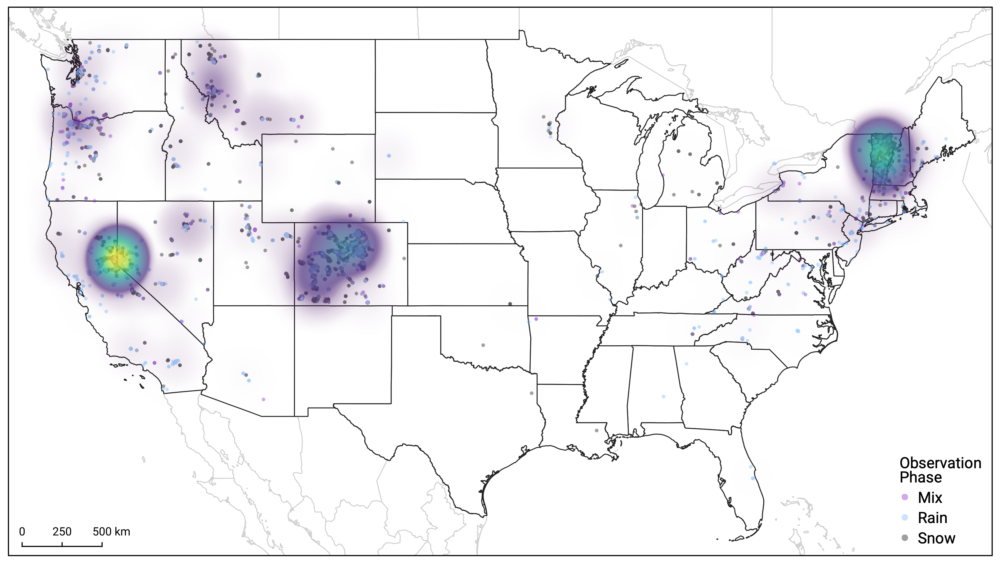
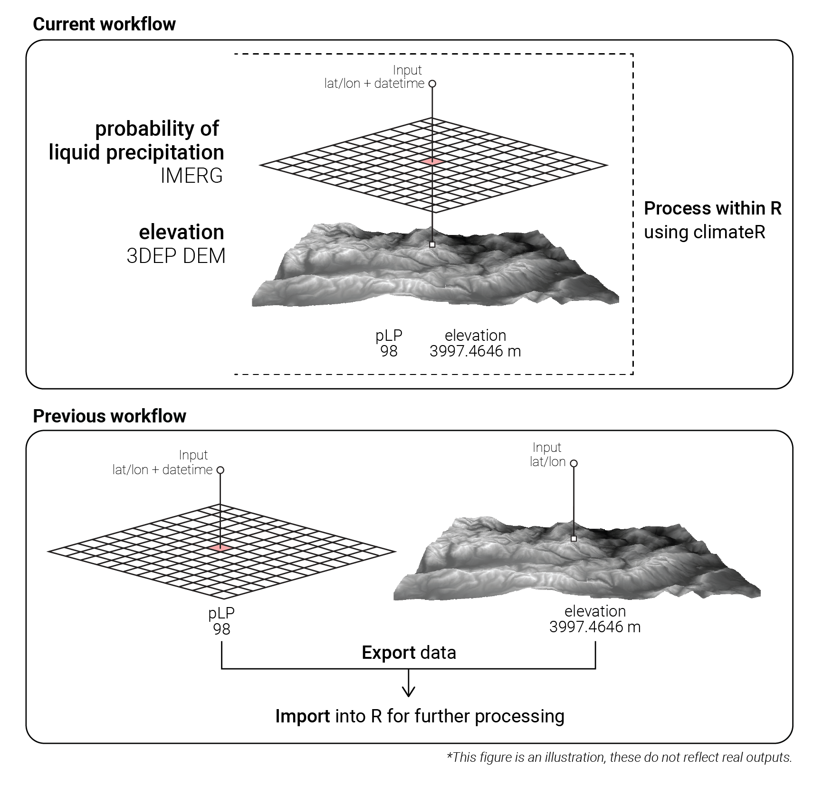

# Rain or snow?

[Mountain Rain or Snow](https://www.rainorsnow.org/) is a citizen science project with the goal to better predict precipitation phase funded by NASA's Citizen Science for Earth Systems Program (CSESP). Citizen scientists across the Continental United States respond to 'What is falling from the sky?' by reporting precipitation observations as rain, mixed, or snow using a mobile app. Over several years, the project has collected around 40,000 observations (Figure 1). This observation is easy for human observers to make but challenging for atmospheric models to predict. This valuable dataset provides a basis to improve such models.

```{r, echo = FALSE, out.width = "100%", fig.cap = "Citizen science observations from 2021-2023."}



```

## A data assimilation challenge

Each observation point requires rigorous data processing to eventually model outputs for the air, dew point, wet-bulb temperatures, and relative humidity value at the observation point. Additionally, as part of the project's mission to improve satellite-based algorithms, each observation point has an associated probability of liquid precipitation (pLP) from [IMERG](https://gpm.nasa.gov/data/imerg), a gridded NASA product.

The raw outputs for each observation are a timestamp, location of the report (latitude/longitude), and the reported precipitation phase. Ancillary information like elevation and station data from meteorological networks near the observation are critical inputs for the temperature modeling.

Previous processing workflows collected data from various platforms and providers, and then brought into R for further analysis. This meant accessing elevation and pLP data via an external platform for the observation point, then exporting those data to bind with a dataframe. This process required intermediate file storage and maintaining code unique to each data provider.

To ensure workflow reproducibility and simplify the processing chain, the Mountain Rain or Snow team integrated climateR to organize this workflow. climateR has a large (and growing) catalog of data providers. A benefit of this approach is that it allows for future changes in the processing of phase observations. New data products or model output can be quickly subset and included without adding additional dependencies to the codebase or writing code to robustly access large, gridded files. All processing is now kept in a single language (R), with seamless retrieval for elevation and pLP data from external providers and integration with the original dataframe. A summary of the process is illustrated in Figure 2.

***More about the data***

Elevation data for an observation point is extracted from the USGS 3DEP 1/3 arc-second (10-meter) dataset, the highest resolution USGS DEM available (see [`get3DEP`](https://mikejohnson51.github.io/climateR/reference/get3DEP.html) function). The IMERG pLP data are accessed in through the [`dap`](https://mikejohnson51.github.io/climateR/reference/dap.html) function, which allows for consistent data retrieval from NASA's Goddard Earth Sciences Data and Information Services Center (GES DISC).

```{r, echo = FALSE, fig.cap = "Illustration for the current versus previous workflow. The current workflow uses climateR functions to create a more organized workflow all within R. The previous workflow had more steps utilizing external data collection platforms to collect the same data, making it difficult to reproduce the workflow."}



```

Both functions from climateR provide solutions that may be unique to the Mountain Rain or Snow project, but integrating multiple data products is a common problem that many projects face. Adding to the issue, reproducibility is core to practicing good science, and ordered workflows are often difficult to establish. A single platform approach to data collection and processing with climateR solves these issues.


## Acknowledgments {.appendix}

Thank you Dillon Ragar ([Lynker](https://lynker.com)) and Rachel Bash ([Lynker](https://lynker.com)) for their review on this article. 

As mentioned in the article, Mountain Rain or Snow is funded by NASA's Citizen Science for Earth Systems Program. Co-PIs for Mountain Rain or Snow are Dr. Keith Jennings ([Lynker](https://lynker.com)), Meghan Collins ([DRI](https://www.dri.edu/), [UNR](https://www.unr.edu/)), and Dr. Monica Arienzo ([DRI](https://www.dri.edu/), [UNR](https://www.unr.edu/)).

