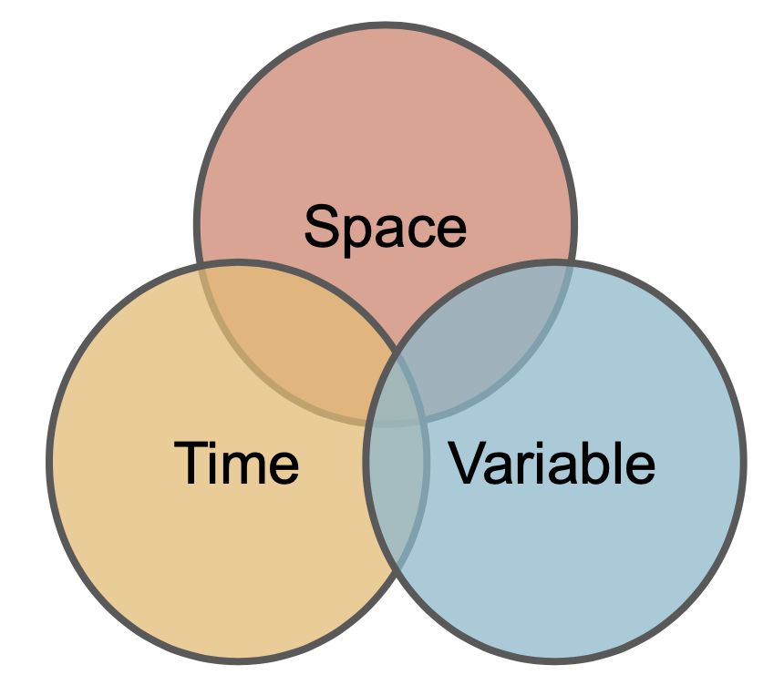

```{r, echo=FALSE}
knitr::opts_chunk$set(
  collapse = TRUE,
  comment = "#>",
  out.width = "100%",
  warning = FALSE,
  message = FALSE
)
```


```{r, echo = FALSE}
library(dplyr)
library(kableExtra)


df = c('Data', 'id',  'The primary resource name or catalog of data assets',
 'Data',  'asset',  'The subdatasets or assets in the collection',
 'Data',  'URL', 'The asset URL ', 
 'Data',  'type', 'The data format reached by URL  (e.g. vrt, opendap)',  
 'Variable',  'varname',  'The filename, band name, or dap varname' , 
 'Variable',  'variable',  'General high order variable type' ,
 'Variable',  'description', 'Long form description of asset' ,
 'Variable',  'units',  'The units of the values in the asset', 
 'Variable',   'model',  'The name of the model generating data in asset',  
 'Variable',   'ensemble',   'model ensemble member of asset',
 'Variable' ,  'scenario',  'The model scenario of asset' , 
 'Time',   'duration',  'Time range of asset represented as {start}/{end}' ,
 'Time',   'interval', 'A numeric stride with a unit'  ,
 'Time' ,  'Tname',  'The name of the time dimension'  ,
 'Time',   'nT' , 'The number of time layers in the model' , 
 'Space',  'X1' , 'The first value in the X coordinate array, typically Xmin'  ,  
 'Space',   'Xn',  'The last value in the X coordinate array, typically Xmax'  ,
 'Space',   'Y1',  'The first value in the Y coordinate array, typically Ymin',  
 'Space',   'Yn',  'The last value in the Y coordinate array, typically Ymax',  
 'Space',   'Xname' , 'The name of the X dimension',  
 'Space',   'Yname',  'The name of the Y dimension',  
 'Space' ,  'Xres' , 'The resolution of the data in the X direction',  
 'Space',   'Yres',  'The resolution of the data in the Y direction',  
 'Space',   'ncols',  'The number of values in the X direction', 
 'Space',   'nrows', 'The number of grid cells  in the Y direction',
 'Space',   'crs',  'The coordinate reference system expressed as PROJ4 string', 
 'Space' ,  'toptobottom',  'arrangement of the unfolded data array',  
 'Space',   'tiled',  'is data tiled spatially (XY), temporally (T), or not (NA)',
 'Space',   'dimorder',  'order of data diminisons (e.g. XYZT)') %>% 
  matrix(ncol = 3, byrow = T) %>% 
  as.data.frame() %>% 
  setNames(c("Purpose", "Name", "Description")) 

df = df %>% 
  mutate(col = case_when(
    Purpose == "Data" ~ "#BDC2BB",
    Purpose == "Space" ~ "#D8836C",
    Purpose == "Time" ~ "#E9BA6B",
    Purpose == "Variable" ~ "#83BBCD",
  ))


```

```{r, echo = FALSE, out.width="25%" }

```

```{r, echo = FALSE}
img = df %>% 
  select(-col, -Purpose) %>% 
  kbl(booktabs = T, linesep = "") %>% 
  kable_paper(full_width = F) %>%
  column_spec(1, width = "5em", background = df$col, bold = T) %>% 
  column_spec(2, width = "30em") #%>% 
 # as_image()

img
```


```{r, echo = FALSE, out.width="49%",  out.height="90%",fig.cap="caption",fig.show='hold',fig.align='center'}
#knitr::include_graphics(c(img, "../man/figures/space-time-variable-vendiagram.png"))
``` 

